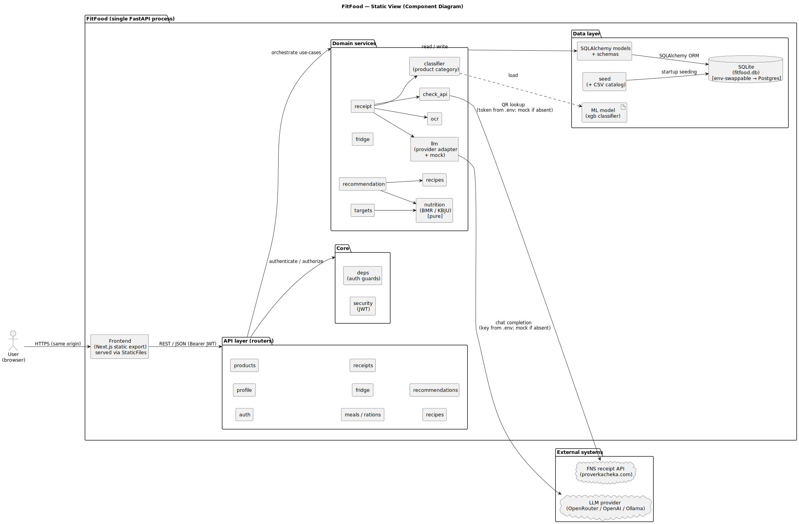
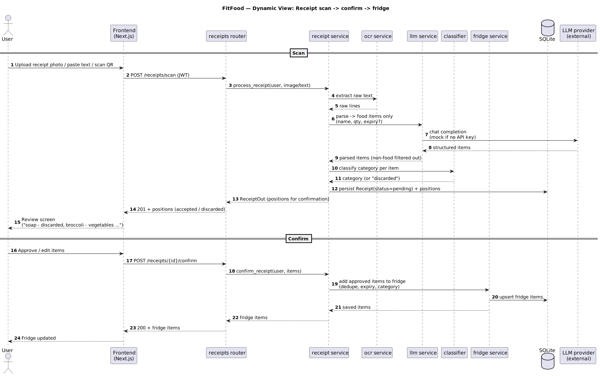
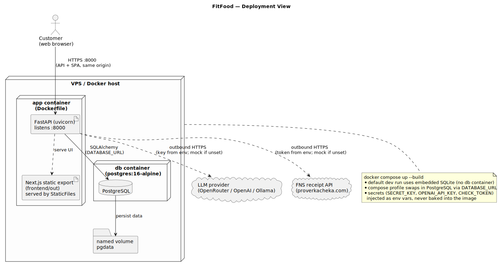

# FitFood — Architecture

This is the maintained architecture documentation for FitFood ("smart fridge").
It describes the system from three reasoning angles — a **static view**, a
**dynamic view**, and a **deployment view** — and links the
[Architecture Decision Records](adr/README.md) that explain *why* the system is
shaped this way.

Diagrams are kept as **diagrams-as-code** (PlantUML) so the sources are
versioned with the product and reviewed in the normal PR workflow. Sources live
next to this file:

```
docs/architecture/
├── README.md                 # this file
├── static-view/              # component diagram (.puml)
├── dynamic-view/             # sequence diagram(s) (.puml)
├── deployment-view/          # deployment diagram (.puml)
└── adr/                      # Architecture Decision Records
```

Rendered SVGs are produced from these sources by the documentation build
(see [Rendering diagrams](#rendering-diagrams)).

## System summary

FitFood is a **modular monolith**: a single FastAPI process that exposes a REST
API and also serves the Next.js frontend as a static export. It computes
nutrition targets (KBJU), tracks a food diary, manages a per-user virtual
fridge, ingests groceries by scanning receipts (OCR + LLM, or the FNS QR API),
and recommends recipes from what the user actually has. Persistence is through
SQLAlchemy over SQLite by default (PostgreSQL in the compose/production profile).

The quality attributes this architecture is optimised for are captured as
measurable scenarios in [`../quality-requirements.md`](../quality-requirements.md)
(QR-1 correctness, QR-2 latency, QR-3 reliability) and traced to the decisions
below.

---

## Static view

**Source:** [`static-view/component-diagram.puml`](static-view/component-diagram.puml)



The component diagram shows the main internal components, the external systems
the product talks to (the LLM provider and the FNS receipt API), and the primary
communication paths.

**What the diagram shows.** Requests enter from the browser to the same-origin
frontend, which calls the **API layer** (FastAPI routers) over REST with a Bearer
JWT. Routers delegate to **domain services**, which are the only layer that
touches the **data layer** (SQLAlchemy models → SQLite/Postgres). Two services
reach outside the process: `llm` (to the LLM provider) and `check_api` (to the
FNS receipt API), both guarded by a mock fallback. The `classifier` service loads
a pre-trained ML model to assign product categories.

**Coupling and cohesion.**
- **Layered, one-directional coupling:** routers → services → models → DB.
  Services never import routers, and the pure `nutrition` module never imports
  the ORM. This keeps dependencies acyclic and the blast radius of a change
  small.
- **High cohesion per service:** each service owns one concern (`nutrition`,
  `recommendation`, `receipt`, `fridge`, …), so related logic changes together
  and is easy to locate and test.
- **Externals isolated behind adapters:** every third-party dependency is reached
  through exactly one service (`llm`, `check_api`), so vendor changes are
  contained (see [ADR-0003](adr/0003-llm-provider-abstraction-mock-fallback.md)).

**Maintainability implications.** New use-cases are added by composing existing
services behind a new router, not by threading DB or vendor calls through the API
layer. The main structural risk is the `receipt` service, which orchestrates OCR,
LLM, the classifier, and the FNS API — it is the highest-fan-out component and
the one to watch for growing coupling as receipt features expand.

**Quality requirements supported/constrained.** The layering and the pure
`nutrition` module directly support **QR-1** (cheap exhaustive correctness tests)
and **QR-2** (no cross-layer surprises on hot read paths). Isolating externals
behind adapters supports **QR-3** (deterministic, key-free test paths).

---

## Dynamic view

**Source:** [`dynamic-view/receipt-scan-sequence.puml`](dynamic-view/receipt-scan-sequence.puml)



**Scenario.** Ingesting groceries by scanning a receipt: upload/scan → parse to
food-only items with expiry → present for confirmation → add approved items to
the fridge.

**Why it matters.** Receipt scanning is the fastest way to populate the fridge,
and the fridge contents drive recommendations — so this flow feeds the product's
headline feature. It is also the most cross-component interaction in the system
(`receipts` router, `receipt`, `ocr`, `llm`, `classifier`, `fridge`, the DB, and
an external provider), which makes it the best flow for reasoning about
integration boundaries.

**What the diagram shows.** The `receipt` service orchestrates OCR → LLM parsing
(non-food items filtered out) → per-item classification, persists a *pending*
receipt, and returns the parsed positions for the user to review ("soap —
discarded, broccoli — vegetables …"). Only after an explicit confirm call does
the `fridge` service write approved items (deduped, with category and expiry).

**What it lets a reader reason about.**
- The **integration boundary** to the LLM provider — and the mock fallback that
  keeps the flow working (and deterministic) without a key
  ([ADR-0003](adr/0003-llm-provider-abstraction-mock-fallback.md)).
- The **two-phase (scan → confirm)** design that keeps the user in control of
  what enters their fridge, matching the customer requirement for a confirmation
  step.

---

## Deployment view

**Source:** [`deployment-view/deployment-diagram.puml`](deployment-view/deployment-diagram.puml)



**What the diagram shows.** The customer's browser talks HTTPS to a single `app`
container (FastAPI/uvicorn on :8000) that serves both the API and the static SPA.
In the compose/production profile the app talks to a `db` container (PostgreSQL)
whose data lives in a named volume; the default dev run uses embedded SQLite and
no db container. The app makes outbound calls to the LLM provider and the FNS
receipt API, each optional and mock-guarded. Secrets are injected as environment
variables and never baked into the image.

**Why this model was chosen.** One (or two) containers on a single VPS is the
least operational overhead for a small team shipping to one customer and TA, and
a same-origin API+SPA avoids CORS and an extra network hop
([ADR-0004](adr/0004-single-process-api-and-static-frontend.md)). Making the
datastore an environment choice lets the same image run on SQLite in CI and
Postgres in production ([ADR-0002](adr/0002-sqlite-default-swappable-postgres.md)).

**How it supports / constrains the product.** The customer-facing access path is
a single URL, easy to deploy and roll back. The trade-off is that the frontend
and backend release together, and static assets are served by the app process
rather than a CDN — acceptable at current scale, revisit under real traffic.

**What to consider when operating it.** Set a real `SECRET_KEY`, provide
`OPENAI_API_KEY`/`OPENROUTER_API_KEY` and `CHECK_TOKEN` via env if the live
integrations are wanted (otherwise mock mode runs), and back up the database
volume.

---

## Architecture Decision Records

The decisions that shape the views above are recorded as ADRs. Each ADR names the
quality requirement it primarily supports; [`../quality-requirements.md`](../quality-requirements.md)
links back from each QR to its ADR(s).

| ADR | Decision | Primary QR |
|---|---|---|
| [0001](adr/0001-pure-nutrition-domain.md) | Pure, side-effect-free nutrition (KBJU) module | [QR-1](../quality-requirements.md#qr-1-kbju-calculation-correctness) |
| [0002](adr/0002-sqlite-default-swappable-postgres.md) | SQLite by default, env-swappable to PostgreSQL | [QR-2](../quality-requirements.md#qr-2-read-endpoint-response-time) |
| [0003](adr/0003-llm-provider-abstraction-mock-fallback.md) | LLM/OCR provider abstraction + deterministic mock | [QR-3](../quality-requirements.md#qr-3-recommendation-determinism--ingredient-validity) |
| [0004](adr/0004-single-process-api-and-static-frontend.md) | One process serves API + static frontend | [QR-2](../quality-requirements.md#qr-2-read-endpoint-response-time) |

**How the architecture and the decisions fit together.** The layered component
structure (static view) makes the correctness and latency requirements cheap to
test (ADR-0001, ADR-0002); the adapter boundary visible in the dynamic view makes
the reliability requirement testable without secrets (ADR-0003); and the
single-process, env-configured topology (deployment view) keeps the product to
one deployable unit that runs identically in CI and production (ADR-0004,
ADR-0002).

---

## Rendering diagrams

The `.puml` sources are the source of truth. To render SVGs locally:

```bash
# with a local PlantUML jar
java -jar plantuml.jar -tsvg docs/architecture/**/*.puml
```

The hosted documentation build renders these sources to SVG as part of publishing
the docs site (see [`docs/development-process.md`](../development-process.md) and
the docs workflow).
