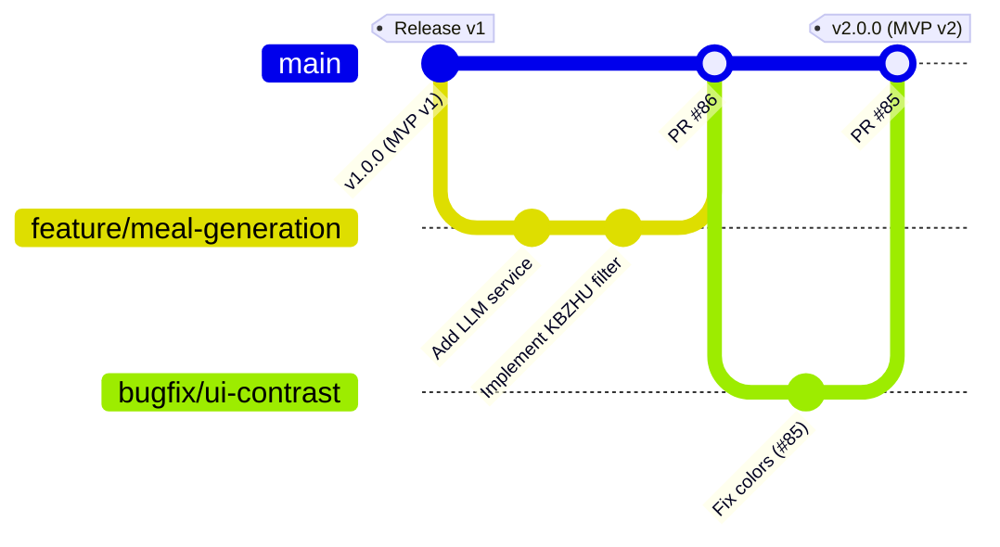

# Development Process & Configuration Management

This document outlines the standard operating procedures, Agile workflow, and configuration management practices for the FitFood Tracker team.

## 1. Agile & Sprint Workflow
Our team follows the Scrum framework to ensure iterative delivery and continuous feedback.
* **Sprint Cycle:** We work in Sprints, prioritizing tasks from the Product Backlog into the Sprint Backlog during Sprint Planning.
* **Task Board:** We use a Kanban-style board (To Do, In Progress, In Review, Done) to visualize work and track the status of Product Backlog Items (PBIs).
* **Customer Collaboration:** At the end of each Sprint, we conduct a Sprint Review and UAT session with our customer to demonstrate the working increment and gather feedback.

## 2. Definition of Done (DoD)
A Product Backlog Item (PBI) or issue is considered "Done" only when it meets all the following criteria:
* Code is fully implemented and runs without critical errors.
* Automated CI pipelines (including `pytest`, `coverage`, `Bandit`, and `pip-audit`) pass successfully.
* The feature is deployed to the university VM or cloud environment.
* Code has been reviewed and approved by at least one other team member.
* The customer has accepted the feature during the Sprint Review/UAT.

For more detailed quality requirements, refer to our full [Definition of Done](definition-of-done.md).

## 3. Issue Tracking & Traceability
To maintain strict traceability from customer feedback to deployed code:
* **No orphaned code:** Every commit and branch must be tied to a specific issue/PBI on our tracking board.
* **Naming Convention:** All commit messages and Pull/Merge Request titles MUST include the corresponding issue number in brackets. 
  * *Example:* `[#86] Implement LLM meal generation prompt` or `Fix UI contrast [#85]`.
* **State Updates:** Moving an issue to the "In Review" column requires an active Pull Request.

## 4. Configuration Management & Git Workflow
Our configuration management relies on a strict Git workflow to protect the stability of the core product.

### Git Workflow Diagram

### How our team uses this workflow:
1. **Main Branch Protection:** The `main` branch is strictly protected. Direct pushes are disabled.
2. **Feature Branching:** Developers create isolated branches for every issue (e.g., `feature/issue-name` or `bugfix/issue-number`).
3. **Pull Requests (PRs):** To merge changes into `main`, a developer must open a PR.
4. **Code Review & CI Gates:** The PR cannot be merged until it passes all automated CI checks and receives approval from at least one reviewer.
5. **Releases:** Stable versions at the end of a Sprint are tagged to mark release milestones and ensure rollback capability if needed.
