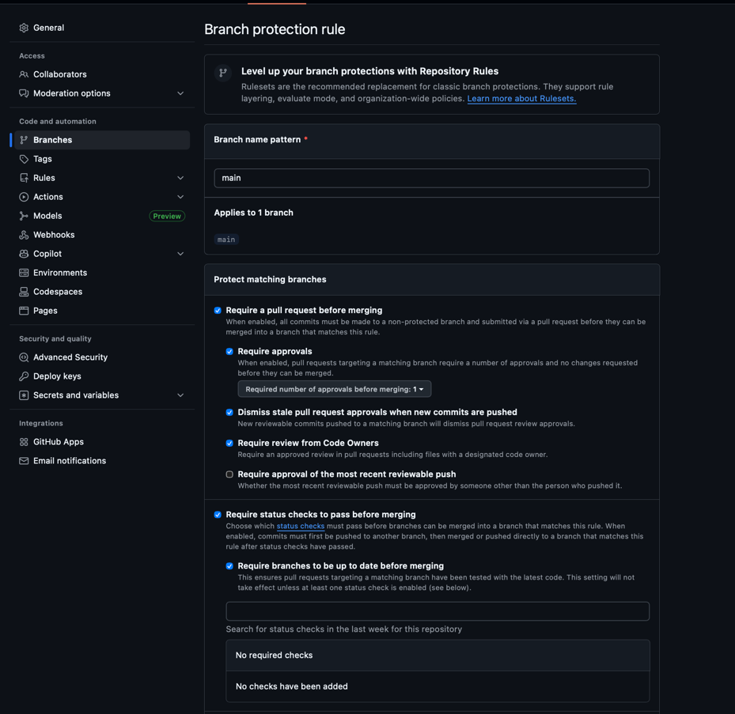
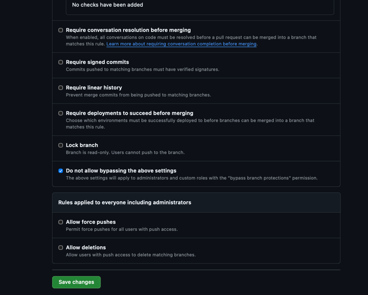
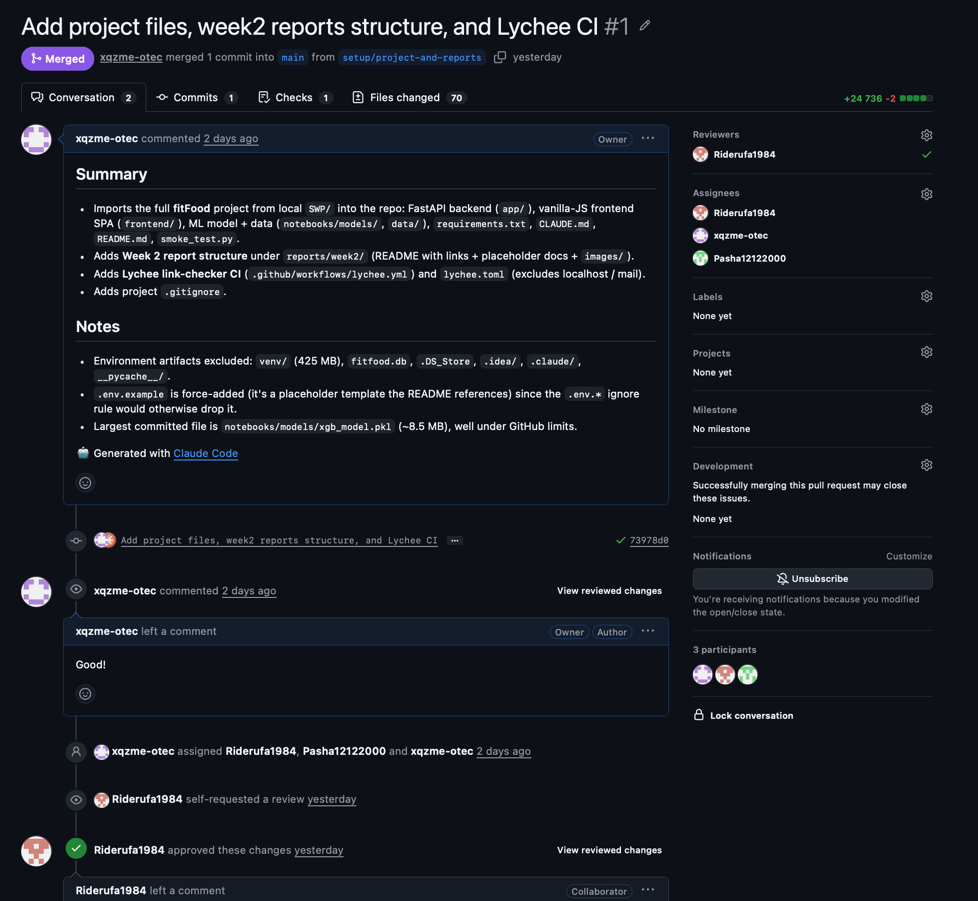
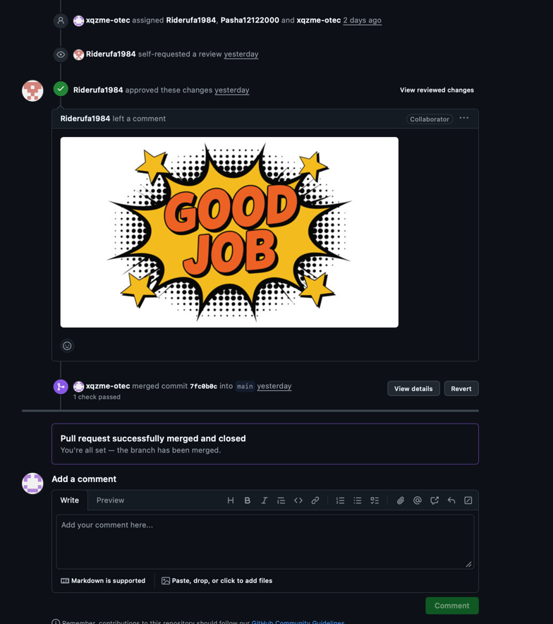

# Week 2 Report — fitFood

**fitFood — умный холодильник (smart fridge).** A FastAPI web service that tracks daily
calories and macronutrients (KБЖУ), manages a personal fridge inventory (manual entry and
receipt scanning via OCR + LLM with an ML category classifier), and recommends recipes from
what the user actually has on hand against their remaining nutrition targets.

- **License:** [MIT License](../../LICENSE)
- **Repository:** <https://github.com/xqzme-otec/fitFood>

This document is the **index** for the Week 2 deliverables. Each required artifact is linked
directly below.

## Requirements & user stories

- [Prioritized user stories + MVP scope](user-stories.md)

## Prototype & interface artifacts

- **Figma prototype / interface board:**
  <https://www.figma.com/board/6cUCM7YkJI9J1LYWwHXHiA/Welcome-to-FigJam?node-id=0-1&t=M2JLpoFtP0qwcno8-1>

## MVP v0

- [MVP v0 report](mvp-v0-report.md) — foundation overview + repeatable smoke-check scenario.
- **Deployed / runnable artifact & run instructions:** [root README](../../README.md)
  (`docker compose up --build -d` → <http://127.0.0.1:8000/>, Swagger at `/docs`; or
  `python smoke_test.py` for the end-to-end smoke check).
- **Public video demonstration:**
  <https://drive.google.com/file/d/1ijP0o_c1nPwK6E2ZAou4nDwxQJPRsSLG/view?usp=sharing>

## Customer meeting

- [Customer meeting summary](customer-meeting-summary.md)
- [Customer meeting transcript](customer-meeting-transcript.md)
- [Customer meeting notes](customer-meeting-notes.md)

## Process artifacts

- [Pull-request template](../../.github/PULL_REQUEST_TEMPLATE.md)
- **Reviewed PRs created during Week 2** (all reviewed and merged into the protected `main`):
  - [PR #1 — Project files, week2 reports structure, and Lychee CI](https://github.com/xqzme-otec/fitFood/pull/1)
  - [PR #2 — Project files, Docker deployment, and week2 reports structure](https://github.com/xqzme-otec/fitFood/pull/2)
  - [PR #3 — Add prioritized user stories and MVP scope](https://github.com/xqzme-otec/fitFood/pull/3)
  - [PR #4 — Add analysis of week 2 learnings and plans](https://github.com/xqzme-otec/fitFood/pull/4)

## Link checking (Lychee)

- **Configuration:** [`lychee.toml`](../../lychee.toml) and the workflow
  [`.github/workflows/lychee.yml`](../../.github/workflows/lychee.yml).
- **Latest successful run on the protected default branch (`main`):**
  <https://github.com/xqzme-otec/fitFood/actions/runs/27503723671>

### Excluded links — list, justification & manual verification

The Lychee configuration ([`lychee.toml`](../../lychee.toml)) excludes the following from
automated checking:

| Excluded pattern | Justification | Manual verification |
|------------------|---------------|---------------------|
| `^http://localhost` | Local-only address that resolves to the machine running the app; not a public URL, so a CI runner / external browser cannot reach it. | Verified by running the app per the [run instructions](../../README.md) and opening the served pages locally. |
| `^http://127.0.0.1` | Loopback address (same rationale as `localhost`); only reachable while the service is running locally. | Verified locally via `docker compose up` / `uvicorn`, confirming <http://127.0.0.1:8000/> and `/docs` respond. |
| `exclude_mail = true` (`mailto:` addresses) | Email addresses are not HTTP resources and cannot be link-checked. | No `mailto:` links are present in the Week 2 reports; nothing to verify. |

All excluded entries are local/non-HTTP by nature; there are **no excluded public external
links**. Every public external link in this report (Figma board, Google Drive demo, GitHub
PRs and Actions run) was visited in a browser and confirmed accessible before submission.

## Screenshots

### Protected default branch (`main`) configuration

### Reviewed & approved pull request

## Coverage

This section maps the Week 2 deliverables to the stable user-story IDs in
[user-stories.md](user-stories.md).

### Prototype & interface artifacts

The [Figma board](https://www.figma.com/board/6cUCM7YkJI9J1LYWwHXHiA/Welcome-to-FigJam?node-id=0-1&t=M2JLpoFtP0qwcno8-1)
captures the core interface concepts of fitFood: registration/login, the daily nutrition
("Today") view, the fridge inventory grouped by category, the receipt-scan confirmation
flow, and recipe recommendations. It represents the following stable user-story IDs:

- **US-10** — User registration and authentication (entry / sign-in screens)
- **US-03** — Daily macronutrient tracking (Today view: calories + KБЖУ)
- **US-01** — Adding products to inventory (manual add + receipt-scan confirmation)
- **US-08** — Inventory search (fridge search / browsing)
- **US-06** — Expiration-date tracking (expiry badges in the fridge)
- **US-02** — Smart recipe recommendations (recipe suggestions screen)

### MVP v0

The [MVP v0 report](mvp-v0-report.md) explains the product foundation and documents the
**repeatable smoke-check scenario** (`python smoke_test.py`), an offline end-to-end run
through auth → profile → targets → diary → fridge → receipt scan → recommendations.

MVP v0 is a product foundation and does not need to fully implement any single user story.
The foundation it establishes represents these stable user-story IDs:

- **US-10** — Registration/authentication infrastructure (`/auth/*` with JWT) is in place
  and smoke-checked, even though the complete login UX is planned for MVP v1.
- **US-03** — KБЖУ/macro calculation (Mifflin–St Jeor → TDEE → goal) and the day/meal
  diary summary.
- **US-01** — Manual fridge add (auto category via ML, auto expiry via LLM mock) and the
  receipt scan → confirm pipeline.
- **US-08** — Catalog and fridge search / grouped views.
- **US-06** — Expiry date + status (soon-expiring / expired) on fridge items.
- **US-02** — Recipe recommendations scored by fridge coverage and remaining macros.

## Analysis & LLM report

- [Week 2 analysis](analysis.md) — learnings, validated assumptions, items needing
  clarification, and planned responses.
- [LLM usage report](llm-report.md) — how AI/LLM tools were (and were not) used.
