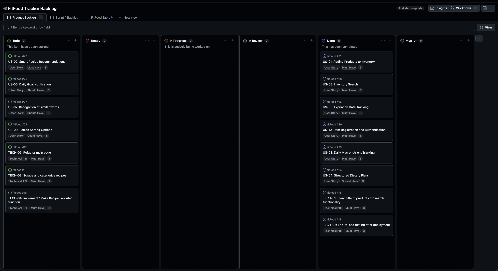
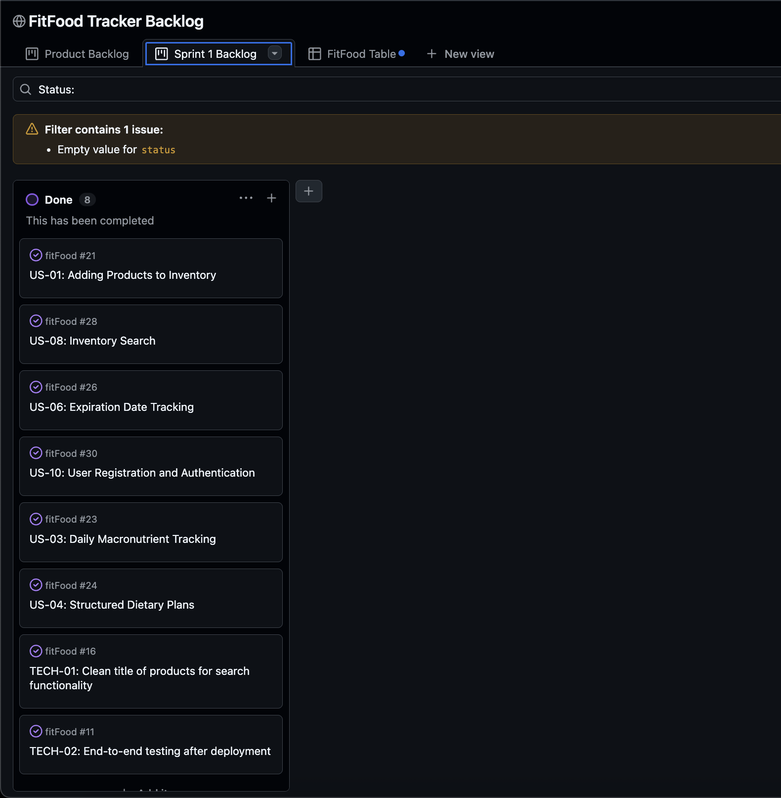
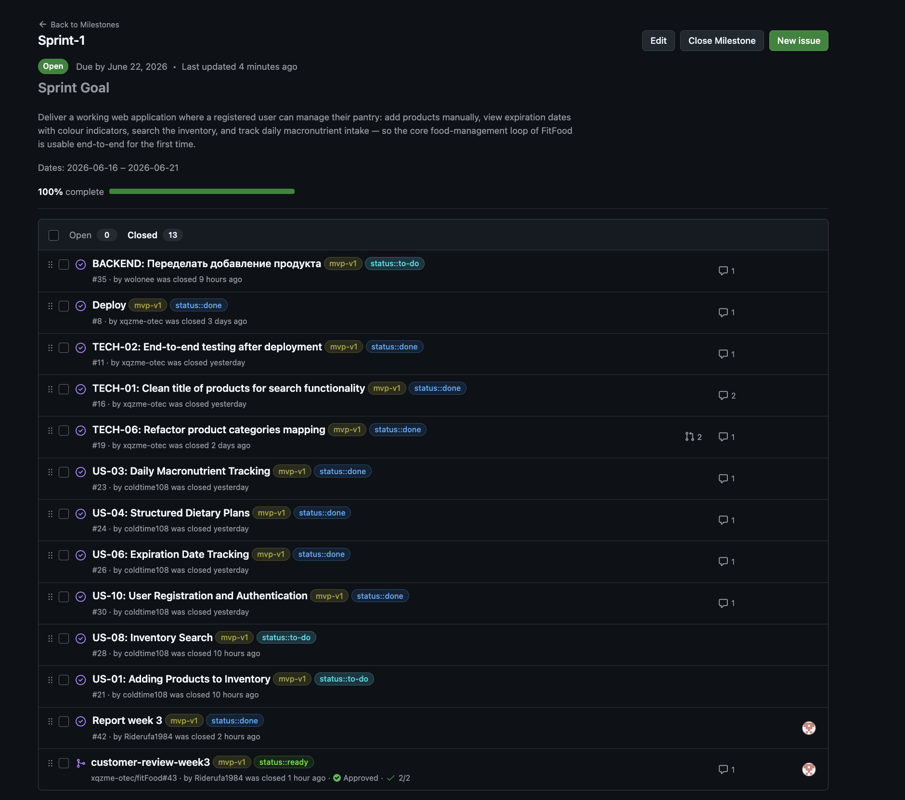
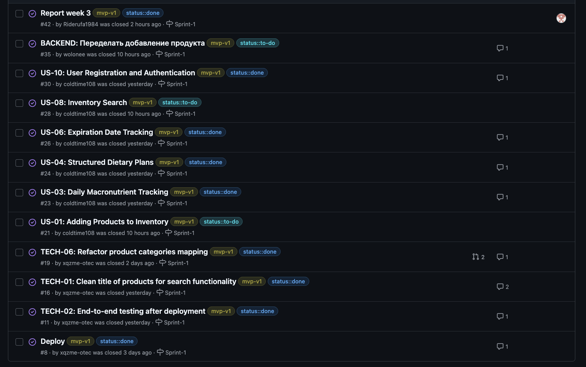
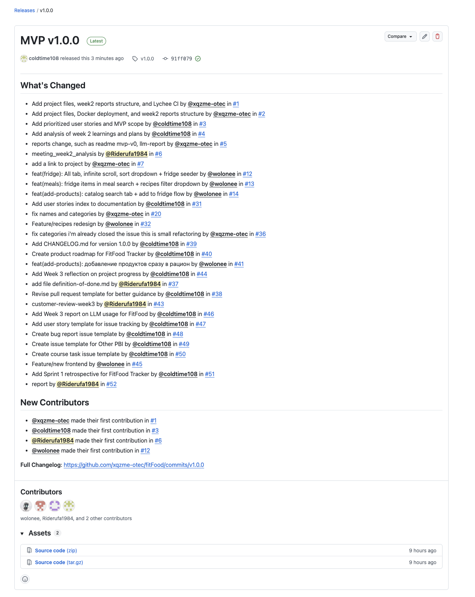
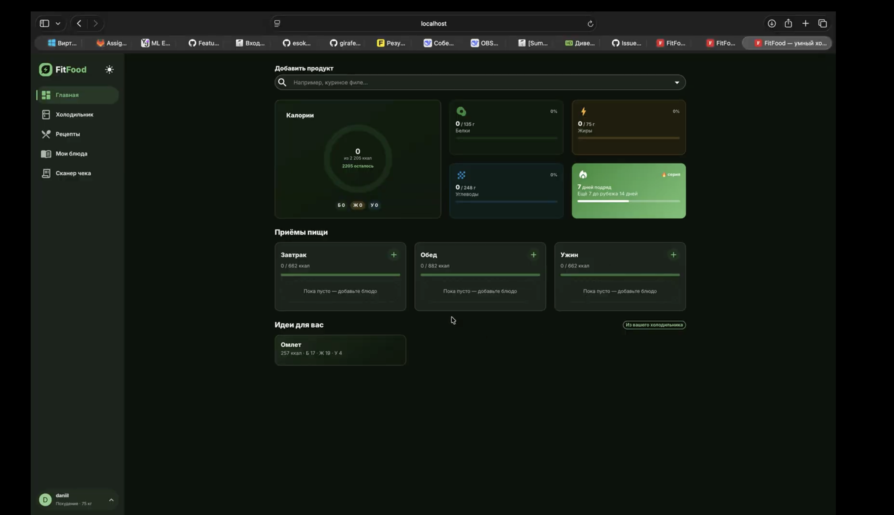
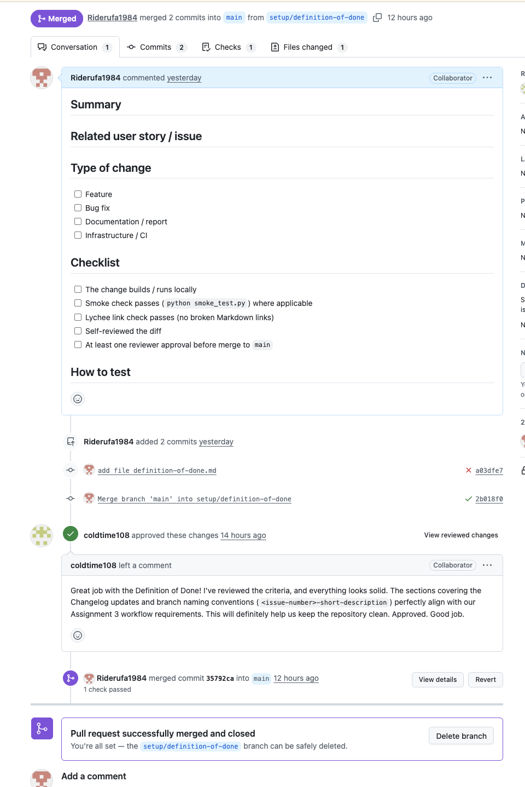

# FitFood Tracker — Week 3 Report (Assignment 3)

**FitFood** is an AI-powered web application that helps users eat healthier, waste less food, and save time. It tracks pantry products, monitors expiration dates, recommends recipes based on available ingredients, and provides personalised macronutrient tracking.

**Team 27** · [MIT License](../../LICENSE)

---

## Table of Contents

- [FitFood Tracker — Week 3 Report (Assignment 3)](#fitfood-tracker--week-3-report-assignment-3)
  - [Table of Contents](#table-of-contents)
  - [1. Scope Summary](#1-scope-summary)
  - [2. Customer Feedback from Assignment 2](#2-customer-feedback-from-assignment-2)
  - [3. User Story Index](#3-user-story-index)
  - [4. Product Backlog](#4-product-backlog)
  - [5. Sprint 1 Backlog](#5-sprint-1-backlog)
  - [6. MVP v1 Scope](#6-mvp-v1-scope)
  - [7. PBI Types, Statuses, and Workflow](#7-pbi-types-statuses-and-workflow)
  - [8. Roadmap Summary](#8-roadmap-summary)
  - [9. MVP v1 Verification Evidence](#9-mvp-v1-verification-evidence)
  - [10. Product Status](#10-product-status)
  - [11. Next Steps](#11-next-steps)
  - [12. Contribution Traceability](#12-contribution-traceability)
  - [13. Release and Changelog](#13-release-and-changelog)
  - [14. Key Artifacts and Links](#14-key-artifacts-and-links)
  - [Everything in the table above](#everything-in-the-table-above)
  - [15. Screenshots](#15-screenshots)
  - [16. Customer Review](#16-customer-review)
  - [17. Reports](#17-reports)

---

## 1. Scope Summary

Since Assignment 2 all 10 user stories were migrated from `reports/week2/user-stories.md` into GitHub Issues with stable IDs, MoSCoW priorities, acceptance criteria, and Sprint assignments. The backlog was refined: US-07 (Recognition of similar words) was updated from Could Have to Should Have following customer feedback in the 14 June meeting. No stories were removed.

Five Must Have stories were selected for Sprint 1 / MVP v1. The remaining five stories are active in the backlog and targeted at Sprint 2 and Sprint 3.

Current user story index: [`docs/user-stories.md`](../../docs/user-stories.md)  
Historical Assignment 2 index: [`reports/week2/user-stories.md`](../week2/user-stories.md)

---

## 2. Customer Feedback from Assignment 2

The following feedback points from the 14 June customer review (Assignment 2) were addressed in MVP v1:

| Feedback | Action taken |
|---|---|
| US-07 priority raised from Could Have to Should Have | Updated in `docs/user-stories.md` and issue [#27](https://github.com/xqzme-otec/fitFood/issues/27) |
| Expiry date values must be real, not mocked | Implemented with live shelf-life calculation (US-06, [#26](https://github.com/xqzme-otec/fitFood/issues/26)) |
| Send screen recording of the user flow for review | Screen recording sent to customer; deployed app available at [fitfood-2ol0.onrender.com](https://fitfood-2ol0.onrender.com/#/fridge) |
| UI colour scheme needs redesign (placeholder pink) | Noted as a Should Have item for Sprint 2; not blocking MVP v1 |
| Add product suggestion to KBJU notification (Could Have) | Logged as a new Could Have story for Sprint 3 |
| Receipt/QR scanning not yet implemented | Deferred to Sprint 2; manual text input confirmed as acceptable for MVP v1 |

---

## 3. User Story Index

| ID | Short title | MoSCoW | Issue | Status | Work Status | Sprint |
|---|---|---|---|---|---|---|
| US-01 | Adding Products to Inventory | Must Have | [#21](https://github.com/xqzme-otec/fitFood/issues/21) | Active | Done | [Sprint 1](https://github.com/xqzme-otec/fitFood/milestone/1) |
| US-03 | Daily Macronutrient Tracking | Must Have | [#23](https://github.com/xqzme-otec/fitFood/issues/23) | Active | Done | [Sprint 1](https://github.com/xqzme-otec/fitFood/milestone/1) |
| US-06 | Expiration Date Tracking | Must Have | [#26](https://github.com/xqzme-otec/fitFood/issues/26) | Active | Done | [Sprint 1](https://github.com/xqzme-otec/fitFood/milestone/1) |
| US-08 | Inventory Search | Must Have | [#28](https://github.com/xqzme-otec/fitFood/issues/28) | Active | Done | [Sprint 1](https://github.com/xqzme-otec/fitFood/milestone/1) |
| US-10 | User Registration and Authentication | Must Have | [#30](https://github.com/xqzme-otec/fitFood/issues/30) | Active | Done | [Sprint 1](https://github.com/xqzme-otec/fitFood/milestone/1) |
| US-02 | Smart Recipe Recommendations | Must Have | [#22](https://github.com/xqzme-otec/fitFood/issues/22) | Active | To Do | — |
| US-05 | Daily Goal Notification | Must Have | [#25](https://github.com/xqzme-otec/fitFood/issues/25) | Active | To Do | — |
| US-04 | Structured Dietary Plans | Should Have | [#24](https://github.com/xqzme-otec/fitFood/issues/24) | Active | To Do | — |
| US-07 | Recognition of similar words | Should Have | [#27](https://github.com/xqzme-otec/fitFood/issues/27) | Active | To Do | — |
| US-09 | Recipe Sorting Options | Could Have | [#29](https://github.com/xqzme-otec/fitFood/issues/29) | Active | To Do | — |

Full index with live issue state: [`docs/user-stories.md`](../../docs/user-stories.md)

---

## 4. Product Backlog

- **Product Backlog board/view:** [GitHub Projects — FitFood Backlog](https://github.com/users/coldtime108/projects/1/views/1)
- **Total Product Backlog size:** _63_

The backlog satisfies **DEEP**: near-term Sprint 1 PBIs are fully detailed with acceptance criteria and estimates; Sprint 2–3 stories are estimated at story-level only. The backlog is ordered by MoSCoW priority. Refinement was continuous throughout the Sprint, not deferred to planning.

---

## 5. Sprint 1 Backlog

- **Sprint Backlog board/view:** [GitHub Projects — Sprint 1 Backlog](https://github.com/users/coldtime108/projects/1/views/1)
- **Sprint milestone:** [Sprint 1](https://github.com/xqzme-otec/fitFood/milestone/1) — 2026-06-16 to 2026-06-21
- **Total Sprint 1 size:** _about the half from PB_

The Sprint milestone is the authoritative source for the Sprint Goal, Sprint dates, and current Sprint scope.

---

## 6. MVP v1 Scope

- **MVP v1 filtered view:** [GitHub Projects — MVP v1](https://github.com/users/coldtime108/projects/1/views/1)

**Sprint Goal:** Deliver a working web application where a registered user can manage their pantry — add products manually, view expiration dates with colour indicators, search the inventory, and track daily macronutrient intake — so the core food-management loop of FitFood is usable end-to-end for the first time.

**Selected MVP v1 stories (Must Have only):**

| Issue | Story | Story Points |
|---|---|---|
| [#30](https://github.com/xqzme-otec/fitFood/issues/30) | US-10 User Registration and Authentication | 5 |
| [#21](https://github.com/xqzme-otec/fitFood/issues/21) | US-01 Adding Products to Inventory | 8 |
| [#23](https://github.com/xqzme-otec/fitFood/issues/23) | US-03 Daily Macronutrient Tracking | 5 |
| [#26](https://github.com/xqzme-otec/fitFood/issues/26) | US-06 Expiration Date Tracking | 5 |
| [#28](https://github.com/xqzme-otec/fitFood/issues/28) | US-08 Inventory Search | 3 |

US-02 (Recipe Recommendations) and US-05 (Daily Goal Notifications) were excluded from Sprint 1 because the recipe database had not yet been parsed and integrated; notifications depend on recipes. Both are targeted at Sprint 2.

---

## 7. PBI Types, Statuses, and Workflow

PBI types, Work Status values, acceptance criteria rules, Sprint milestone usage, and Definition of Done are defined in [`Process_Requirements.md`](../../Process_Requirements.md).

**PBI types used in this project:**

- **User Story** — feature requests in "As a [role], I want [action], so that [benefit]" format, tracked with stable IDs (US-01 … US-10).
- **Other PBI** — technical, infrastructure, design, deployment, and testing tasks that support user stories. Created as separate linked issues when the work needs its own implementer, reviewer, acceptance criteria, or estimation.
- **Bug Report** — defects found during development or testing.
- **Course Task** — administrative tasks for course reporting; not counted as PBIs.

**MVP version tracking:** each PBI is tagged with a custom `MVP Version` field in GitHub Projects (`mvp-v1`, `mvp-v2`, `mvp-v3`). Sprint 1 PBIs also carry the label `mvp-v1`.

**Task decomposition:** each user story selected for Sprint 1 was decomposed into linked supporting PBIs (technical sub-tasks). User stories are not closed until all their supporting PBIs are Done.

**Issue templates:** [User Story](../../.github/ISSUE_TEMPLATE/user_story.yml) · [Other PBI](../../.github/ISSUE_TEMPLATE/other_pbi.yml) · [Course Task](../../.github/ISSUE_TEMPLATE/course_task.yml) · [Bug Report](../../.github/ISSUE_TEMPLATE/bug_report.yml)

**PR template:** [`.github/pull_request_template.md`](../../.github/pull_request_template.md)

---

## 8. Roadmap Summary

Sprint 1 (2026-06-16 – 2026-06-21) delivered the core pantry management loop: registration, product addition, KBJU tracking, expiry date tracking, and inventory search.

Sprint 2 will target recipe recommendations (US-02), daily goal notifications (US-05), receipt/QR scanning, and synonym recognition (US-07).

Full roadmap: [`docs/roadmap.md`](../../docs/roadmap.md)

---

## 9. MVP v1 Verification Evidence

Each Sprint 1 PBI was verified against its acceptance criteria before merge. Verification evidence is recorded in the linked PR for each supporting PBI:

| Story | Supporting PRs / Verification |
|---|---|
| US-10 Registration | _Link PR here_ |
| US-01 Adding Products | _Link PR here_ |
| US-03 KBJU Tracking | _Link PR here_ |
| US-06 Expiry Dates | _Link PR here_ |
| US-08 Inventory Search | _Link PR here_ |

---

## 10. Product Status

MVP v1 is fully delivered and accessible at **[fitfood-2ol0.onrender.com](https://fitfood-2ol0.onrender.com/#/fridge)**.

A registered user can:
- Create an account and configure their profile (weight, daily routine, KBJU targets, number of meals)
- Add products to the pantry manually via text search; products are classified into 13 categories by an XGBoost model (~91–92% accuracy) trained on Magnit catalogue data
- Track daily calorie and macronutrient intake (proteins, fats, carbohydrates) per meal
- View pantry products with expiration dates and colour-coded freshness indicators (green / yellow / red)
- Search and filter the pantry inventory

Not yet implemented: receipt/QR scanning, recipe recommendations, daily goal notifications.

---

## 11. Next Steps

- **Sprint 2:** implement receipt scanning (US-01 extension), parse and load recipe database, deliver recipe recommendations (US-02) and daily goal notifications (US-05), add synonym recognition (US-07), update UI colour scheme
- Fix README deployment URL (action point from 18 June meeting)
- Add integration tests for core MVP v1 flows
- Integrate external expiration date data source (identified in 18 June meeting)

Affected issues: [#21](https://github.com/xqzme-otec/fitFood/issues/21) [#22](https://github.com/xqzme-otec/fitFood/issues/22) [#25](https://github.com/xqzme-otec/fitFood/issues/25) [#27](https://github.com/xqzme-otec/fitFood/issues/27)

---

## 12. Contribution Traceability

| Member | GitHub | Role | Issues | PRs created | PRs reviewed |
|---|---|---|---|---|---|
| Daniil Vishnevskii | [@xqzme-otec](https://github.com/xqzme-otec) | Product Owner · Tech Lead · Data Engineer | _#19, #16, #11, #8_ | _https://github.com/xqzme-otec/fitFood/actions?query=event%3Apull_request+actor%3Axqzme-otec_ | _-_ |
| Timur Ishmuratov | [@coldtime108](https://github.com/coldtime108) | Scrum Master · Backend Developer | _#30, #28, #26, #24, #23, #21_ | _https://github.com/xqzme-otec/fitFood/actions?query=actor%3Acoldtime108+event%3Apull_request_ | _-_ |
| Artemiy Tiglev | [@wolonee](https://github.com/wolonee) | Developer · Software Architect · Backend | _#35_ | _https://github.com/xqzme-otec/fitFood/actions?query=event%3Apull_request+actor%3Awolonee_ | _-_ |
| Pavel Romanov | [@Pasha12122000](https://github.com/Pasha12122000) | Developer · Frontend · Integration | _none_ | _https://github.com/xqzme-otec/fitFood/actions?query=event%3Apull_request+actor%3APasha12122000_ | _-_ |
| Egor Gilmanov | [@Riderufa1984](https://github.com/Riderufa1984) | Developer · Frontend · UI/UX | _#42_ | _https://github.com/xqzme-otec/fitFood/actions?query=actor%3ARiderufa1984+event%3Apull_request_ | _-_ |

Each team member pushed at least one commit, created at least one issue-linked PR, reviewed and approved at least one teammate's PR, and left at least one meaningful review comment.

---

## 13. Release and Changelog

- **SemVer release mapped to MVP v1:** [v1.0.0](https://github.com/xqzme-otec/fitFood/releases/tag/v1.0.0)
- **CHANGELOG:** [`CHANGELOG.md`](../../CHANGELOG.md)

---

## 14. Key Artifacts and Links

| Artifact | Link |
|---|---|
| Deployed MVP v1 | [fitfood-2ol0.onrender.com](https://fitfood-2ol0.onrender.com/#/fridge) |
| Root README (access & run instructions) | [`README.md`](../../README.md) |
| Video demonstration (<2 min) | [Video](https://drive.google.com/file/d/1skfvNK2yCVh-acfnuSRsyUPqqVO-nYiM/view?usp=sharing) |
| Product Backlog board | [GitHub Projects](https://github.com/users/coldtime108/projects/1/views/1) |
| Sprint 1 Backlog view | [Sprint 1 view](https://github.com/users/coldtime108/projects/1/views/1) |
| Sprint 1 milestone | [Milestone](https://github.com/xqzme-otec/fitFood/milestone/1) |
| MVP v1 filtered view | [MVP v1 view](https://github.com/users/coldtime108/projects/1/views/1) |
| v1.0.0 Release | [Release](https://github.com/xqzme-otec/fitFood/releases/tag/v1.0.0) |
| `docs/user-stories.md` | [Link](../../docs/user-stories.md) |
| `docs/roadmap.md` | [Link](../../docs/roadmap.md) |
| `docs/definition-of-done.md` | [Link](../../docs/definition-of-done.md) |
| `Process_Requirements.md` | [Link](https://gitlab.pg.innopolis.university/swp_26/swp_26/-/blob/main/Process_Requirements.md#product-backlog-items-and-scope) |
| `CHANGELOG.md` | [Link](../../CHANGELOG.md) |
| Issue template — User Story | [Link](https://github.com/xqzme-otec/fitFood/blob/main/.github/ISSUE_TEMPLATE/user-story.md) |
| Issue template — Other PBI | [Link](https://github.com/xqzme-otec/fitFood/blob/main/.github/ISSUE_TEMPLATE/other-pbi.md) |
| Issue template — Course Task | [Link](https://github.com/xqzme-otec/fitFood/blob/main/.github/ISSUE_TEMPLATE/course-task.md) |
| Issue template — Bug Report | [Link](https://github.com/xqzme-otec/fitFood/blob/main/.github/ISSUE_TEMPLATE/bug-report.md) |
| PR template | [Link](https://github.com/xqzme-otec/fitFood/blob/main/.github/PULL_REQUEST_TEMPLATE.md) |

**Reviewed issue-linked PRs from Week 3:**

Everything in the table above 
---

## 15. Screenshots

**Product Backlog view**

**Sprint Backlog view**

**Sprint 1 milestone**

**MVP v1 grouped view**

**v1.0.0 Release**

**Delivered MVP v1**

**Example reviewed PR/MR**

---

## 16. Customer Review

The Sprint Review was held with the customer on **18 June 2026**.

- **Transcript (public):** [customer-review-transcript.md](customer-review-transcript.md)
  _(Publication permitted by the customer at the start of the 14 June meeting.)_
- **Summary:** [customer-review-summary.md](customer-review-summary.md)

The customer reviewed the implemented MVP v1 increment, confirmed that all five delivered stories meet the agreed scope, and approved MVP v1. Requested changes and follow-up items are tracked as new or updated issues in the Product Backlog.

---

## 17. Reports

- [Reflection](reflection.md)
- [Retrospective](retrospective.md)
- [LLM Report](llm-report.md)
