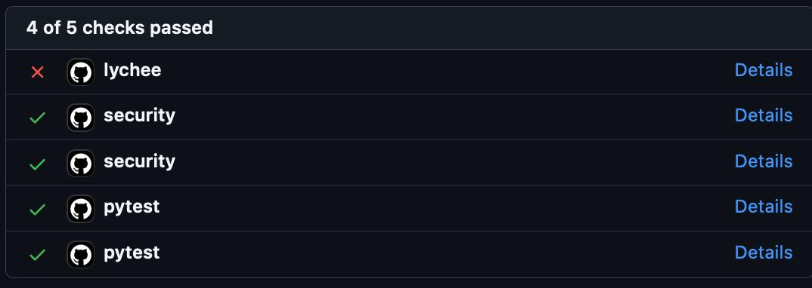
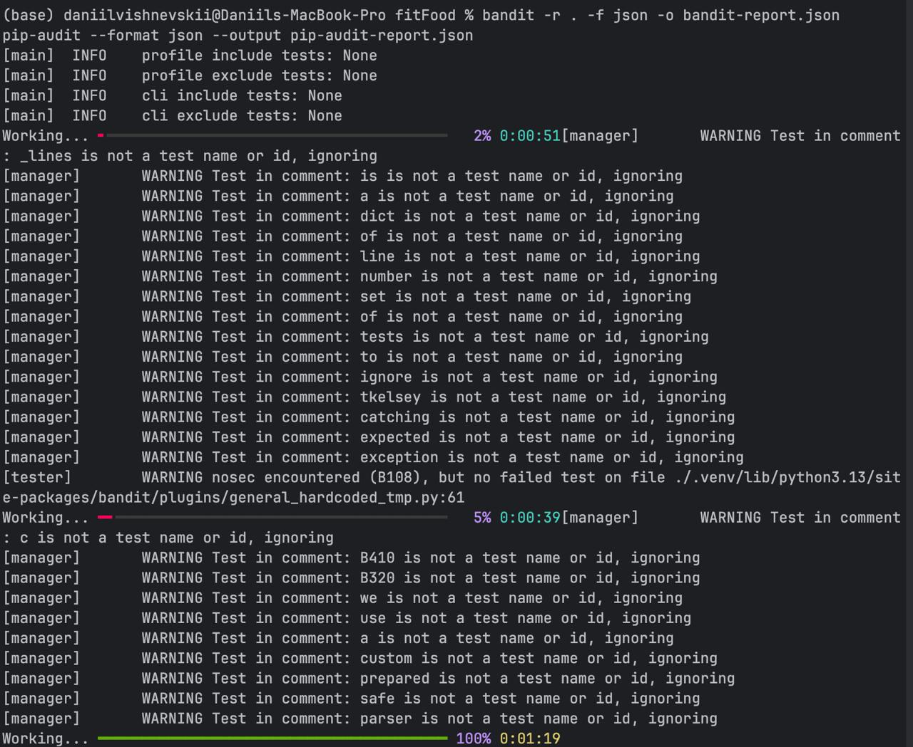
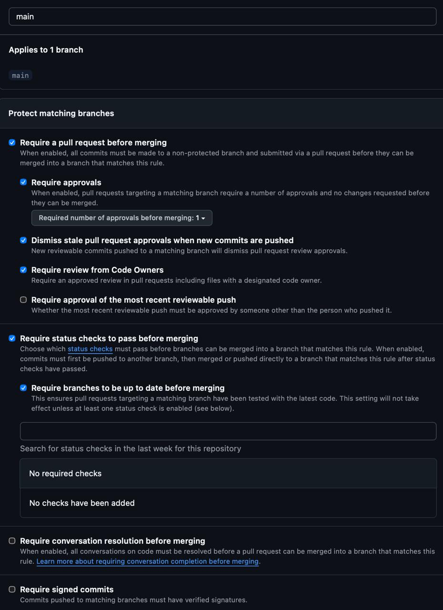
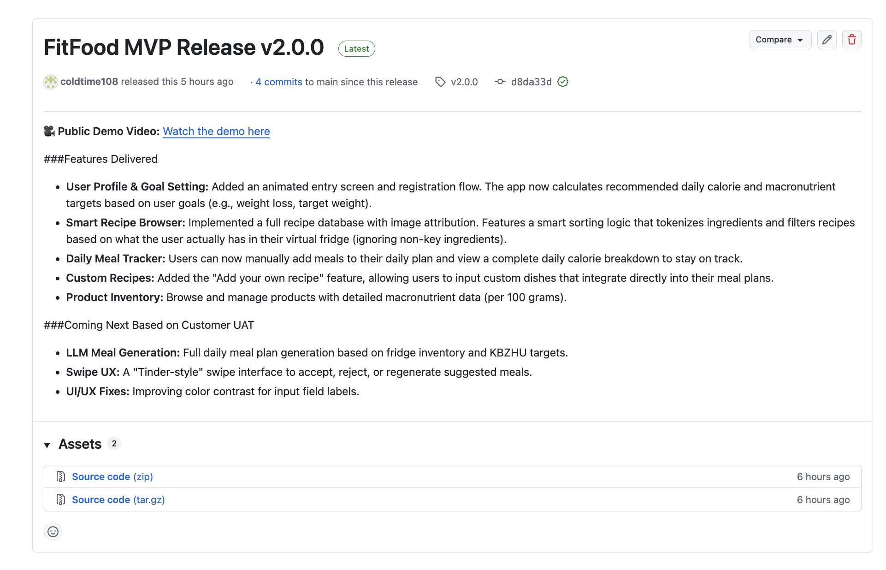
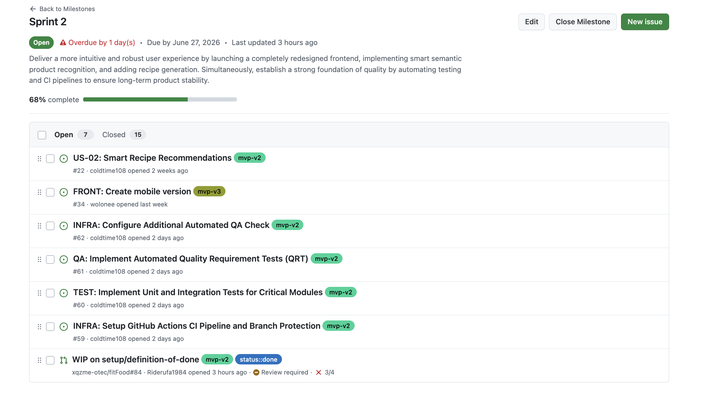
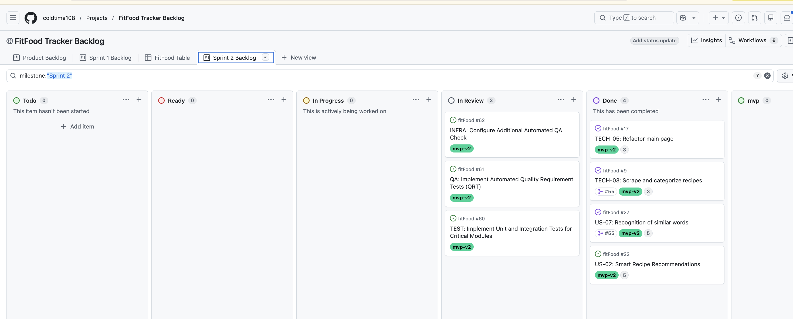

# FitFood Tracker — Week 4 Report (Assignment 4)

**FitFood** is an AI-powered web application that helps users eat healthier, waste less food, and save time. It tracks pantry products, monitors expiration dates, recommends recipes based on available ingredients, and provides personalised macronutrient (KБЖУ) tracking.

**Team 27** · [MIT License](../../LICENSE)

---

## Table of Contents

- [1. Scope Summary](#1-scope-summary)
- [2. Customer Feedback Response](#2-customer-feedback-response)
- [3. Product Backlog](#3-product-backlog)
- [4. Sprint 2 Backlog](#4-sprint-2-backlog)
- [5. Quality Requirements & Automated Testing](#5-quality-requirements--automated-testing)
- [6. CI, Branch Protection & QA Checks](#6-ci-branch-protection--qa-checks)
- [7. Release and Changelog](#7-release-and-changelog)
- [8. Deployed Product & Access](#8-deployed-product--access)
- [9. Demo Video](#9-demo-video)
- [10. User Acceptance Testing](#10-user-acceptance-testing)
- [11. Customer Review (Sprint Review)](#11-customer-review-sprint-review)
- [12. Product Status](#12-product-status)
- [13. Next Steps](#13-next-steps)
- [14. Contribution Traceability](#14-contribution-traceability)
- [15. Screenshots](#15-screenshots)
- [16. Reports](#16-reports)

---

## 1. Scope Summary

**Sprint Goal:** Deliver a more intuitive and robust user experience by launching a completely redesigned frontend, implementing smart semantic product recognition, and adding recipe generation. Simultaneously, establish a strong foundation of quality by automating testing and CI pipelines to ensure long-term product stability.

- **Sprint dates:** 22 June 2026 – 28 June 2026 (milestone due date shows 27 June — see note below)
- **Sprint milestone:** [Sprint 2](https://github.com/xqzme-otec/fitFood/milestone/2) — 23 issues (7 open / 16 closed), **68% complete** as of this report
- **Total Sprint size:** _TODO: fill in total Story Points for Sprint 2 from the milestone/Projects view (issue count above is not the same as Story Points)_

> **Known gap found in the milestone screenshot (Section 15):** the GitHub milestone's due date is set to **27 June 2026**, one day earlier than the Sprint end date used throughout this report and `docs/roadmap.md` (28 June 2026), and the milestone shows as **"Overdue by 1 day(s)"** with 7 issues still open. Either correct the milestone due date to 28 June, or close/move the remaining 7 open issues before submission.

This Sprint shifted weight from new product features toward **quality, automation, and customer feedback**, per the Assignment 4 focus: a redesigned frontend (Next.js + MUI), semantic/synonym product search, automated Quality Requirement Tests, CI coverage and security gates, and a refreshed Definition of Done — rather than maximizing the number of closed issues.

Full roadmap: [`docs/roadmap.md`](../../docs/roadmap.md)

---

## 2. Customer Feedback Response

Feedback points from the Week 2/3 customer reviews and their resolution this Sprint:

[`docs/feedback-response.md`](../../docs/feedback-response.md)

Feedback not addressed this Sprint (e.g. barcode-based expiry lookup, photo-based receipt OCR, Tinder-style recipe swipe UI) is explicitly marked **"Not planned for this Sprint"** in that table, with the reasoning recorded inline (prioritizing core logic, QA testing, and CI pipelines for the Assignment 4 deadline).

---

## 3. Product Backlog

- **Product Backlog board/view:** [GitHub Projects — FitFood Tracker Backlog](https://github.com/users/coldtime108/projects/1/views/1) ("Product Backlog" tab)
- **Current user story index:** [`docs/user-stories.md`](../../docs/user-stories.md)

---

## 4. Sprint 2 Backlog

- **Sprint Backlog board/view:** [GitHub Projects — Sprint 2 Backlog](https://github.com/users/coldtime108/projects/1/views/1) (filtered with `milestone:"Sprint 2"`; screenshot in Section 15)
- **Sprint milestone:** [Sprint 2](https://github.com/xqzme-otec/fitFood/milestone/2) — 2026-06-22 to 2026-06-28

**Selected Sprint 2 scope** (from [`docs/roadmap.md`](../../docs/roadmap.md), cross-checked against the board's `Sprint 2 Backlog` view):

| Issue | Item | Type | Board status |
|---|---|---|---|
| [#22](https://github.com/xqzme-otec/fitFood/issues/22) | US-02 Smart Recipe Recommendations | User Story | Done |
| [#27](https://github.com/xqzme-otec/fitFood/issues/27) | US-07 Recognition of similar words (semantic search) | User Story | Done |
| [#33](https://github.com/xqzme-otec/fitFood/issues/33) | Create new frontend | Other PBI | _not visible in board screenshot_ |
| [#59](https://github.com/xqzme-otec/fitFood/issues/59) | Set up GitHub Actions CI pipeline and branch protection | Other PBI | _not visible in board screenshot_ |
| [#60](https://github.com/xqzme-otec/fitFood/issues/60) | Implement unit and integration tests for critical modules | Other PBI | In Review |
| [#61](https://github.com/xqzme-otec/fitFood/issues/61) | Implement automated Quality Requirement Tests (QRT) | Other PBI | In Review |
| [#82](https://github.com/xqzme-otec/fitFood/issues/82) | Configure additional automated QA check | Other PBI | In Review |
| [#17](https://github.com/xqzme-otec/fitFood/issues/17) | TECH-05: Refactor main page | Other PBI | Done |
| [#9](https://github.com/xqzme-otec/fitFood/issues/9) | TECH-03: Scrape and categorize recipes | Other PBI | Done |

`#82`, `#17`, and `#9` were found on the board screenshot but were not yet listed in [`docs/roadmap.md`](../../docs/roadmap.md) — roadmap should be updated to include them. `#33` and `#59` are in the roadmap's planned scope but did not appear in the visible board columns in the screenshot below (they may be in a column cut off from view, e.g. `mvp`) — verify their actual status before submission.

The Sprint milestone is the authoritative source for the Sprint Goal, Sprint dates, and current Sprint scope.

---

## 5. Quality Requirements & Automated Testing

- **Quality requirements:** [`docs/quality-requirements.md`](../../docs/quality-requirements.md)
- **Quality Requirement Tests (QRTs):** [`docs/quality-requirement-tests.md`](../../docs/quality-requirement-tests.md)
- **Testing & QA strategy:** [`docs/testing.md`](../../docs/testing.md)
- **User Acceptance Tests:** [`docs/user-acceptance-tests.md`](../../docs/user-acceptance-tests.md)
- **Definition of Done:** [`docs/definition-of-done.md`](../../docs/definition-of-done.md)

### Quality model

Three quality requirements were defined, each under a **different** ISO/IEC 25010 characteristic and sub-characteristic:

| ID | Title | ISO/IEC 25010 characteristic | Sub-characteristic | QRT |
|---|---|---|---|---|
| [QR-1](../../docs/quality-requirements.md#qr-1-kbju-calculation-correctness) | KBJU calculation correctness | Functional Suitability | Functional correctness | [QRT-1](../../docs/quality-requirement-tests.md#qrt-1--nutrition-correctness) |
| [QR-2](../../docs/quality-requirements.md#qr-2-read-endpoint-response-time) | Read-endpoint response time | Performance Efficiency | Time behaviour | [QRT-2](../../docs/quality-requirement-tests.md#qrt-2--api-latency) |
| [QR-3](../../docs/quality-requirements.md#qr-3-recommendation-determinism--ingredient-validity) | Recommendation determinism & ingredient validity | Reliability | Maturity | [QRT-3](../../docs/quality-requirement-tests.md#qrt-3--recommendation-determinism--validity) |

### Testing status

| Critical module | Line coverage |
|-----------------|---------------|
| `app/services/nutrition.py` | 97% |
| `app/services/targets.py` | 86% |
| `app/services/recommendation.py` | 95% |
| `app/services/classifier.py` | 90% |
| `app/services/receipt.py` | 90% |
| `app/services/fridge.py` | 97% |

Global repository coverage is ~94%. All critical modules clear the required ≥30% per-module threshold by a wide margin (enforced by [`scripts/check_critical_coverage.py`](../../scripts/check_critical_coverage.py) in CI). Full breakdown and rationale: [`docs/testing.md`](../../docs/testing.md#critical-modules--coverage).

- **Unit tests:** [`tests/test_nutrition.py`](../../tests/test_nutrition.py), [`tests/test_recommendation_service.py`](../../tests/test_recommendation_service.py), [`tests/test_classifier.py`](../../tests/test_classifier.py), [`tests/test_fridge_service.py`](../../tests/test_fridge_service.py), [`tests/test_emoji.py`](../../tests/test_emoji.py)
- **Integration tests:** [`tests/test_auth.py`](../../tests/test_auth.py), [`tests/test_profile.py`](../../tests/test_profile.py), [`tests/test_targets.py`](../../tests/test_targets.py), [`tests/test_fridge.py`](../../tests/test_fridge.py), [`tests/test_diary.py`](../../tests/test_diary.py), [`tests/test_dishes.py`](../../tests/test_dishes.py), [`tests/test_receipts.py`](../../tests/test_receipts.py), [`tests/test_recommendations.py`](../../tests/test_recommendations.py), [`tests/test_receipt_to_recommendation.py`](../../tests/test_receipt_to_recommendation.py)
- **Automated Quality Requirement Tests:** [`tests/test_qrt_nutrition.py`](../../tests/test_qrt_nutrition.py) (QRT-1), [`tests/test_qrt_latency.py`](../../tests/test_qrt_latency.py) (QRT-2), [`tests/test_qrt_recommendation_determinism.py`](../../tests/test_qrt_recommendation_determinism.py) (QRT-3)

### Continuity into later Sprints

The `tests` and `qa` CI workflows, the per-critical-module coverage gate, the three QRTs, and the updated Definition of Done are **maintained project assets** (per [`docs/definition-of-done.md`](../../docs/definition-of-done.md) and [`docs/testing.md`](../../docs/testing.md)). Later PBIs must keep them passing or extend them with documented equivalent-or-stronger coverage, not bypass or disable them.

---

## 6. CI, Branch Protection & QA Checks

| Check | Workflow | Evidence |
|---|---|---|
| Unit + integration tests, coverage, critical-module gate | [`tests`](../../.github/workflows/tests.yml) |  (`pytest` ✅) |
| Additional QA check (Bandit + pip-audit) | [`qa`](../../.github/workflows/qa.yml) | Same CI run above (`security` ✅); local terminal run:  |
| Markdown link checking | [`lychee`](../../.github/workflows/lychee.yml) | Same run above — **currently failing (❌)**; see note below. Does not satisfy the Assignment 4 additional QA check requirement regardless. |
| Branch protection on `main` | — |  |

- **CI pipeline (Actions tab):** <https://github.com/xqzme-otec/fitFood/actions>
- **Latest runs on the protected default branch:** <https://github.com/xqzme-otec/fitFood/actions?query=branch%3Amain> — _TODO: replace with the permalink to the specific latest run shown above before submission_

> **Known gap found in the CI run screenshot above:** `lychee` (Markdown link checking) is currently **failing** on `main` (4 of 5 checks passed). Per Assignment 4 Part 8 #3, the latest protected-default-branch CI run must pass before submission — find and fix the broken link before submitting. The duplicated `pytest`/`security` entries in the screenshot are the same two workflows reported once for `push` and once for `pull_request`.
>
> **Known gap found in the branch protection screenshot above:** "Require status checks to pass before merging" is enabled, but no actual status checks are selected ("No required checks" / "No checks have been added"). This means the `tests` and `qa` workflows currently run on every push/PR but are **not actually enforced as merge gates** — a PR could be merged even if they fail. Add `tests` and `qa` as required status checks in Settings → Branches before submission.
>
> **Note on the QA check screenshot above:** it shows a local run of `bandit -r . -f json -o bandit-report.json` (scans the whole repo, including `.venv`, with no severity filter and JSON output), which is a broader invocation than the CI-configured `bandit -r app -ll` in [`qa.yml`](../../.github/workflows/qa.yml) (scans only `app/`, medium+ severity only). Both are valid evidence that the tool runs and the dependency tree is clean, but the CI run linked above is the authoritative gate — not this local invocation.

**Additional QA check selection:** Bandit (static security analysis) + pip-audit (dependency CVE audit), chosen because the app authenticates users (JWT + bcrypt), loads a pickled ML model, and parses untrusted receipt text. Distinct from linting, build, tests, coverage, QRTs, and Lychee link checking. Full rationale, options considered, and limitations: [`docs/testing.md`](../../docs/testing.md#additional-qa-check-assignment-4).

> **Known gap:** no dedicated linting/type-checking CI job is currently configured for either the Python backend or the new Next.js/TypeScript frontend (`npm run lint` exists in [`frontend/package.json`](../../frontend/package.json) but is not wired into CI). This should be added in a follow-up PBI.

---

## 7. Release and Changelog

- **SemVer release mapped to the Sprint 2 increment:** [v2.0.0](https://github.com/xqzme-otec/fitFood/releases/tag/v2.0.0)
- **CHANGELOG:** [`CHANGELOG.md`](../../CHANGELOG.md#200---2026-06-28)

> **Minor formatting issue visible in the release notes above:** `###Features Delivered` and `###Coming Next Based on Customer UAT` are missing the space after `###`, so GitHub renders them as plain text instead of headings. Worth a quick edit on the release page for readability.

---

## 8. Deployed Product & Access

- **Deployed product:** <http://10.93.26.202:8000/> (university VM)
- **Run / access instructions:** [root README](../../README.md)

> **Known risk (carried from the Sprint Review):** the customer could not reach this VM from outside the campus network during the Week 4 session and had to clone and run the project locally instead (see [`customer-review-summary.md`](customer-review-summary.md)). Resolving external access is tracked as a Sprint follow-up action point.

---

## 9. Demo Video

Public sanitized demo video (<2 minutes): [Watch the FitFood Demo](https://drive.google.com/file/d/12gdFBp6DbLOO7XSevkDbnx43qrTKTIeX/view?usp=sharing)

_(No `presentation.pdf` published in this report — slides submitted via the dedicated Moodle slide submission only.)_

---

## 10. User Acceptance Testing

Full scenarios, stable IDs, and execution history: [`docs/user-acceptance-tests.md`](../../docs/user-acceptance-tests.md)

| ID | Scenario | Week 4 result |
|---|---|---|
| [UAT-01](../../docs/user-acceptance-tests.md#uat-01-register-and-set-up-a-goal-profile) | Register and set up a goal profile | **Passed** |
| [UAT-02](../../docs/user-acceptance-tests.md#uat-02-view-the-daily-kbju-calorie-and-macro-breakdown) | View the daily KBJU breakdown | **Passed** |
| [UAT-03](../../docs/user-acceptance-tests.md#uat-03-browse-and-filter-the-recipe-catalog) | Browse and filter the recipe catalog | **Passed** |
| [UAT-04](../../docs/user-acceptance-tests.md#uat-04-add-a-recipe-to-todays-meal-plan-manually) | Add a recipe to today's meal plan manually | **Partially verified** |
| [UAT-05](../../docs/user-acceptance-tests.md#uat-05-generate-todays-meal-plan-automatically-from-the-fridge) | Generate today's meal plan automatically from the fridge | **Not available** (not yet implemented) |

**Most important feedback from UAT:** input field colour contrast needs fixing; meal-plan generation (LLM-based, with a Tinder-style swipe accept/reject UX) is the customer's top priority for the next Sprint. Resulting PBIs are tracked in [`customer-review-summary.md`](customer-review-summary.md#action-points).

---

## 11. Customer Review (Sprint Review)

The Sprint Review (combined with the UAT session above) was held with the customer during Week 4.

- **Transcript (public):** [customer-review-transcript.md](customer-review-transcript.md) — publication permission reused from the Week 2 consent; recording permission for this specific session was requested and granted over Telegram before the call.
- **Summary:** [customer-review-summary.md](customer-review-summary.md)

The customer accepted the Sprint increment as a solid foundation, requested no rollback of any delivered feature, and set **LLM-based meal-plan generation** as the top priority for the next Sprint. Quality requirements (QR-1/2/3) and the CI quality gates were finalized after this call and were reviewed and approved by the customer separately over Telegram (see the "Quality Requirements & Automated Test Evidence" section of the summary); presenting that evidence live is carried forward to the next Sprint Review.

---

## 12. Product Status

FitFood now has, on top of the Assignment 3 MVP v1:

- A fully redesigned frontend (TypeScript Next.js + MUI SPA), statically exported and served by FastAPI
- A populated recipe catalog with filters and smart, fridge-coverage-aware sorting
- Direct "add to diary" flow from product search, with a live KБЖУ preview
- Semantic/synonym-aware product search (US-07)
- Three automated Quality Requirement Tests (nutrition correctness, API latency, recommendation determinism), each backed by a defined quality requirement
- Per-critical-module test coverage ≥ 30% (actual: 86–97%), enforced in CI
- An additional CI security QA check (Bandit + pip-audit)

Not yet implemented: LLM-based meal-plan generation, the Tinder-style swipe meal-selection UX, photo-based receipt OCR, and externally-reachable deployment.

---

## 13. Next Steps

- **Sprint 3 (top priority):** implement LLM-based meal-plan generation from fridge contents, respecting KБЖУ goals, with regeneration and a Tinder-style swipe accept/reject UX
- Resolve external accessibility of the deployed VM
- Complete photo-based receipt scanning and expiry-date parsing
- Add a dedicated linting/type-checking CI job for both the Python backend and the Next.js frontend
- Present QR-1/2/3 and the CI quality evidence to the customer live in a recorded Sprint Review

Affected issues: see [`docs/feedback-response.md`](../../docs/feedback-response.md) and the Action Points in [`customer-review-summary.md`](customer-review-summary.md#action-points).

---

## 14. Contribution Traceability

_TODO: confirm/update per-member issues, PRs, and review activity for Sprint 2 — table below carries over team roles from Week 3 and needs Sprint 2 numbers filled in._

| Member | GitHub | Role | Issues | PRs created | PRs reviewed |
|---|---|---|---|---|---|
| Daniil Vishnevskii | [@xqzme-otec](https://github.com/xqzme-otec) | Product Owner · Tech Lead · Data Engineer | _TODO_ | <https://github.com/xqzme-otec/fitFood/pulls?q=is%3Apr+author%3Axqzme-otec> | _TODO_ |
| Timur Ishmuratov | [@coldtime108](https://github.com/coldtime108) | Scrum Master · Backend Developer | _TODO_ | <https://github.com/xqzme-otec/fitFood/pulls?q=is%3Apr+author%3Acoldtime108> | _TODO_ |
| Artemiy Tiglev | [@wolonee](https://github.com/wolonee) | Developer · Software Architect · Backend | _TODO_ | <https://github.com/xqzme-otec/fitFood/pulls?q=is%3Apr+author%3Awolonee> | _TODO_ |
| Pavel Romanov | [@Pasha12122000](https://github.com/Pasha12122000) | Developer · Frontend · Integration | _TODO_ | <https://github.com/xqzme-otec/fitFood/pulls?q=is%3Apr+author%3APasha12122000> | _TODO_ |
| Egor Gilmanov | [@Riderufa1984](https://github.com/Riderufa1984) | Developer · Frontend · UI/UX | _TODO_ | <https://github.com/xqzme-otec/fitFood/pulls?q=is%3Apr+author%3ARiderufa1984> | _TODO_ |

Each team member is expected to have pushed at least one commit, created at least one issue-linked PR, reviewed and approved at least one teammate's PR, and left at least one meaningful review comment.

---

## 15. Screenshots

**Sprint 2 milestone**

**Branch protection rules for `main`**

**Latest protected-default-branch CI run**

**Additional QA check result (Bandit + pip-audit, local run)**

**Sprint 2 Backlog board view**

**v2.0.0 SemVer release**

**Example reviewed, issue-linked PR**

_TODO: capture and add the rest to [`images/`](images/), then embed here:_

- Coverage report (e.g. the `coverage-xml` artifact or a terminal/HTML view)

---

## 16. Reports

- [Reflection](reflection.md)
- [Retrospective](retrospective.md)
- [LLM Report](llm-report.md)
