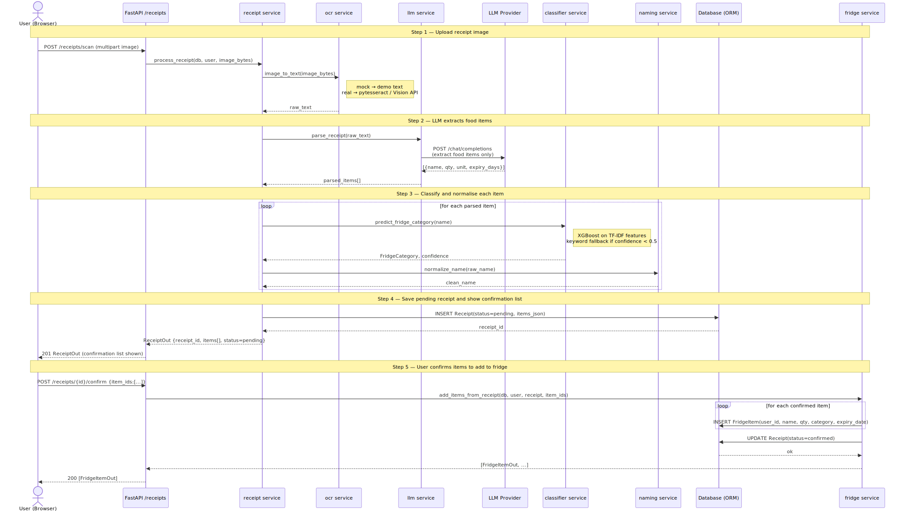
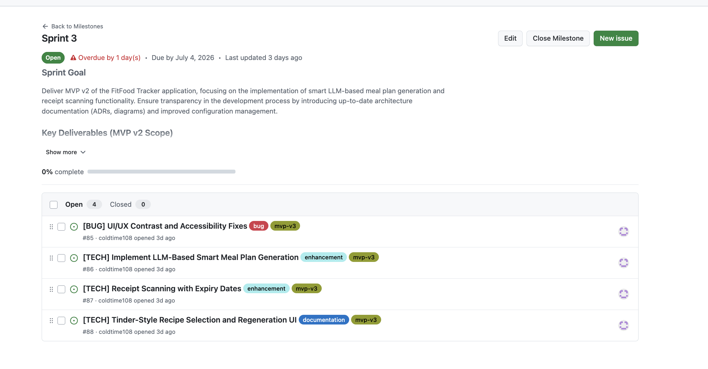
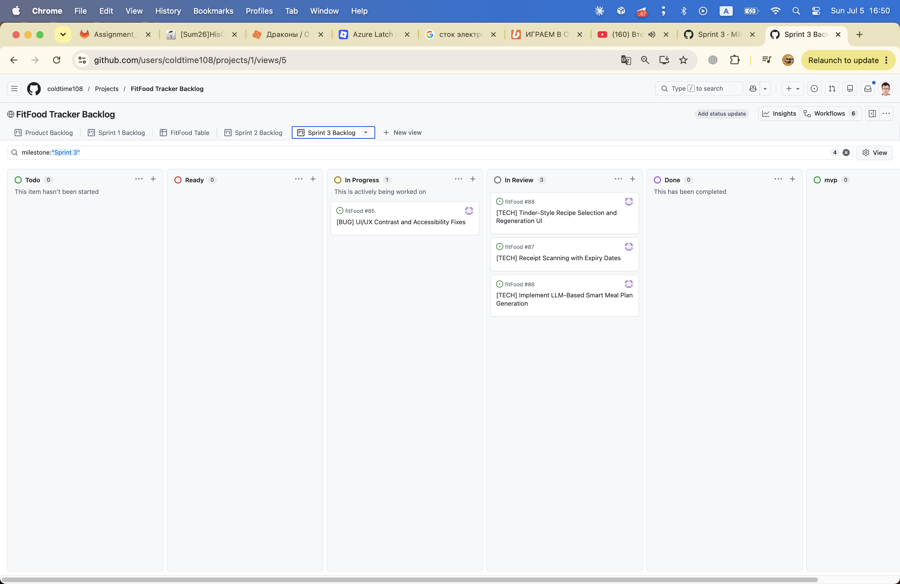
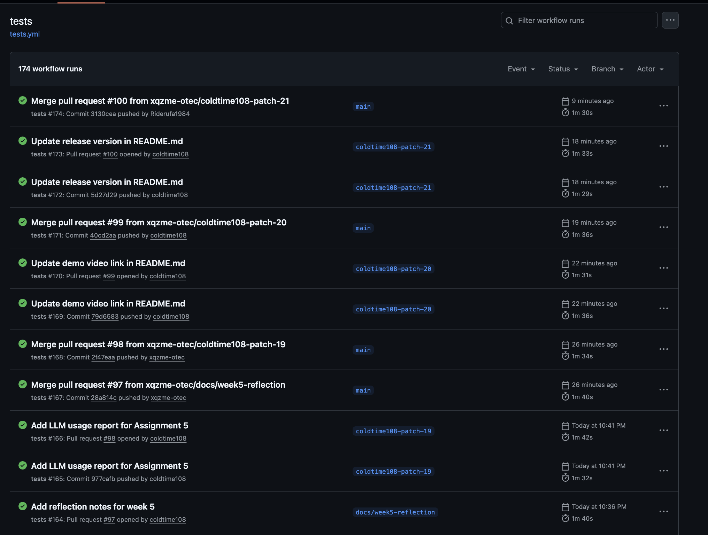
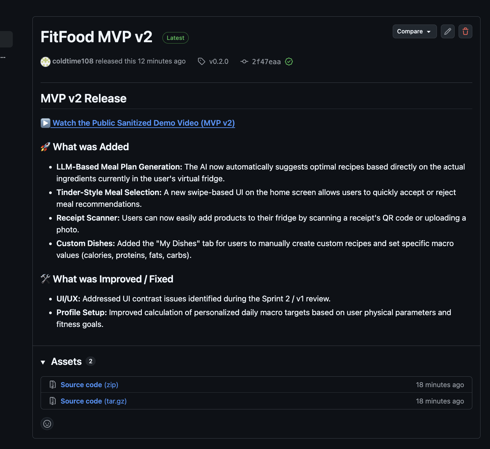
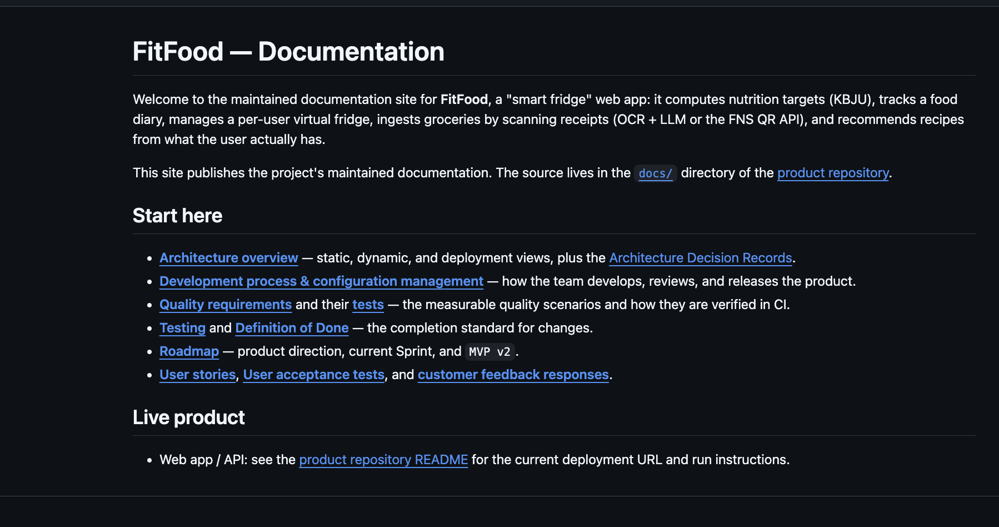

# FitFood Tracker — Week 5 Report (Assignment 5)

**FitFood** is an AI-powered web application that helps users eat healthier, waste less food, and save time. It tracks pantry products, monitors expiration dates, recommends recipes based on available ingredients, provides personalised macronutrient (KBJU) tracking, and — as of MVP v2 — generates complete daily meal plans using an LLM.

**Team 27** · [MIT License](../../LICENSE)

---

## Table of Contents

- [1. Sprint 3 Overview](#1-sprint-3-overview)
- [2. Delivered MVP v2 Changes](#2-delivered-mvp-v2-changes)
- [3. Customer Feedback Response](#3-customer-feedback-response)
- [4. Architecture](#4-architecture)
- [5. Quality Requirements and CI](#5-quality-requirements-and-ci)
- [6. User Acceptance Testing](#6-user-acceptance-testing)
- [7. Sprint Review](#7-sprint-review)
- [8. Release and Changelog](#8-release-and-changelog)
- [9. Deployed Product & Access](#9-deployed-product--access)
- [10. Demo Video](#10-demo-video)
- [11. Hosted Documentation](#11-hosted-documentation)
- [12. Documentation Links](#12-documentation-links)
- [13. Product Status](#13-product-status)
- [14. Next Steps](#14-next-steps)
- [15. Contribution Traceability](#15-contribution-traceability)
- [16. Screenshots](#16-screenshots)
- [17. Reports](#17-reports)

---

## 1. Sprint 3 Overview

- **Sprint dates:** 29 June 2026 – 05 July 2026
- **Sprint milestone:** [Sprint 3](https://github.com/xqzme-otec/fitFood/milestone/3)
- **Product Backlog board/view:** [GitHub Projects — FitFood Tracker Backlog](https://github.com/users/coldtime108/projects/1/views/1) ("Product Backlog" tab)
- **Sprint Backlog board/view:** [GitHub Projects — Sprint 3 Backlog](https://github.com/users/coldtime108/projects/1/views/1) (filtered with `milestone:"Sprint 3"`)
- **Total Sprint size:** _TODO: fill in total Story Points from the milestone/Projects view_

**Sprint Goal:** Deliver the MVP v2 increment of the FitFood Tracker, focusing on LLM-based meal plan generation and receipt scanning functionality. Establish architecture documentation (ADRs, diagrams-as-code) and improve configuration management to support continued product evolution.

**Selected Sprint scope:**

| Issue | Item | Status |
|---|---|---|
| [#86](https://github.com/xqzme-otec/fitFood/issues/86) | LLM-Based Smart Meal Plan Generation | Done |
| [#87](https://github.com/xqzme-otec/fitFood/issues/87) | Receipt Scanning with Expiry Dates | Done (file upload path) |
| [#88](https://github.com/xqzme-otec/fitFood/issues/88) | Tinder-Style Recipe Selection and Regeneration UI | Done |
| [#85](https://github.com/xqzme-otec/fitFood/issues/85) | UI/UX Contrast and Accessibility Fixes | In Progress |
| [#35](https://github.com/xqzme-otec/fitFood/issues/35) | Manual product / meal entry | Done |
| Architecture docs (ADRs, diagrams) | Part 4 / Part 5 of Assignment 5 | Done |

---

## 2. Delivered MVP v2 Changes

| Feature | Status at Sprint Review |
|---|---|
| LLM-based meal plan generation | **Done** — functional; quality improvements ongoing |
| "Generate Meal Plan" button on main screen | Done |
| Recipe database as generation source | Done |
| LLM new dish generation (beyond recipe DB) | Done |
| Non-key ingredient threshold (< 50 g excluded from fridge matching) | Done |
| Receipt scanner — file upload path | Done |
| KBJU from product DB on receipt scan | Done |
| LLM KBJU fallback for unmatched products | Done |
| Tinder-style swipe UX for meal selection | Done |
| Manual product/meal entry | Done |
| Architecture documentation (3 views, 3 ADRs) | Done |
| UI contrast improvements | In Progress |
| Fridge ↔ meal consumption quantity deduction | **Not done** — top remaining gap |
| Recipe detail link from generated meal slot | **Not done** — flagged in UAT |
| Generation diversity / rejection memory | **Not done** — flagged in UAT |
| Chestny Znak expiry date integration | **Not done** — customer key requirement |
| Docker image size optimisation | **Not done** — flagged by customer |

---

## 3. Customer Feedback Response

| Feedback point | Resulting PBI or issue | Status | Response |
|---|---|---|---|
| **LLM Meal Plan Generation:** Request for full meal plan generation respecting KBJU and user goals. | [#86](https://github.com/xqzme-otec/fitFood/issues/86) | Done | Implemented LLM generation logic with KBJU filtering and recipe DB + fridge matching. |
| **Tinder-Style UX:** Request for swipe-based recipe selection mechanic. | [#88](https://github.com/xqzme-otec/fitFood/issues/88) | Done | Developed swipe-based card interface for accepting/rejecting meal suggestions. |
| **Receipt Scanner:** Request for receipt parsing with expiry date integration. | [#87](https://github.com/xqzme-otec/fitFood/issues/87) | Done | File upload receipt scanning with API-based parsing; LLM KBJU fallback for unmatched products. |
| **UI/UX Contrast:** Labels were hard to read due to poor colour contrast. | [#85](https://github.com/xqzme-otec/fitFood/issues/85) | In Progress | Refactoring colour palette for WCAG-compliant contrast; not fully complete. |
| **Manual Input:** Request to allow manual entry of products or meals. | [#35](https://github.com/xqzme-otec/fitFood/issues/35) | Done | Manual entry implemented for both products and meals. |
| **AI Recipe Generation Database:** Comprehensive recipe DB needed for full generation. | Future backlog | Deferred | Current MVP focuses on the baseline generation algorithm and existing dataset. |
| **Fridge ↔ meal consumption deduction** (new — raised in Sprint 3 Review) | _TODO: add issue #_ | Sprint 4 | Marking a meal as eaten does not yet deduct quantities from fridge inventory. Top priority for Sprint 4. |
| **Generation diversity / rejection memory** (new — raised in Sprint 3 Review) | _TODO: add issue #_ | Sprint 4 | Same dishes reappear; no rejection memory implemented yet. |
| **Chestny Znak integration** (repeated by customer) | _TODO: add issue #_ | Sprint 4 | Customer's explicit remaining key requirement; integration not yet built. |
| **Docker image optimisation** (new — raised in Sprint 3 Review) | _TODO: add issue #_ | Sprint 4 | Customer flagged image size; target ~200 MB. |
| **Manual calorie tracker (free-text)** (new — raised in Sprint 3 Review) | _TODO: add issue #_ | Sprint 4 | Simple free-text product-level entry for meals eaten outside the app. |

**Feedback not addressed this Sprint:** Chestny Znak integration, Docker image size, generation diversity, and the fridge–meal deduction flow were identified or re-raised during the Sprint 3 Review and could not be addressed within the Sprint. All are captured as Sprint 4 PBIs.

---

## 4. Architecture

Architecture documentation is maintained in [`docs/architecture/README.md`](../../docs/architecture/README.md).

| View | Source | Diagram |
|---|---|---|
| Static — Component Diagram | [`static-view/component-diagram.mmd`](../../docs/architecture/static-view/component-diagram.mmd) |  |
| Dynamic — Sequence Diagram | [`dynamic-view/sequence-receipt-scan.mmd`](../../docs/architecture/dynamic-view/sequence-receipt-scan.mmd) |  |
| Deployment Diagram | [`deployment-view/deployment-diagram.mmd`](../../docs/architecture/deployment-view/deployment-diagram.mmd) |  |

**ADRs:** [`docs/architecture/adr/`](../../docs/architecture/adr/)

| ID | Title | Status | Addresses |
|---|---|---|---|
| [ADR-001](../../docs/architecture/adr/ADR-001-llm-adapter-pattern.md) | LLM Adapter Pattern with Mock Fallback | Accepted | QR-3 |
| [ADR-002](../../docs/architecture/adr/ADR-002-local-ml-classifier.md) | Local XGBoost Classifier for Product Categories | Accepted | QR-2, QR-3 |
| [ADR-003](../../docs/architecture/adr/ADR-003-recommendation-engine.md) | In-Process Recipe Matching without Vector DB | Accepted | QR-2, QR-3 |

**Architecture summary:** FitFood is a single FastAPI application with a layered architecture — nine routers delegate to pure service modules, which access the database through SQLAlchemy ORM. The frontend (Next.js static export) is served directly by FastAPI. ML inference (XGBoost product classifier) runs locally in-process. LLM integration uses an adapter pattern that defaults to a deterministic mock, making all tests and CI independent of API keys.

**How quality requirements link to architecture decisions:** QR-1 (KBJU correctness) is supported by the pure, I/O-free `nutrition` service. QR-2 (API latency) is supported by ADR-002 (local ML, < 5 ms per item) and ADR-003 (fixed-query in-process recipe matching). QR-3 (recommendation determinism) is supported by ADR-001 (mock fallback; no LLM in the recommendation path) and ADR-003 (pure function, stable sort order).

---

## 5. Quality Requirements and CI

- **Quality requirements:** [`docs/quality-requirements.md`](../../docs/quality-requirements.md)
- **Quality Requirement Tests:** [`docs/quality-requirement-tests.md`](../../docs/quality-requirement-tests.md)
- **Testing strategy:** [`docs/testing.md`](../../docs/testing.md)
- **Definition of Done:** [`docs/definition-of-done.md`](../../docs/definition-of-done.md)
- **CI pipeline:** <https://github.com/xqzme-otec/fitFood/actions>
- **Latest protected-default-branch CI run:** _TODO: replace with permalink to the specific latest run on `main`_

All Assignment 4 CI gates remain active: `tests` workflow (pytest, coverage, critical-module gate), `qa` workflow (Bandit + pip-audit), and `lychee` (Markdown link checking).

| Critical module | Coverage |
|---|---|
| `app/services/nutrition.py` | 97% |
| `app/services/targets.py` | 86% |
| `app/services/recommendation.py` | 95% |
| `app/services/classifier.py` | 90% |
| `app/services/receipt.py` | 90% |
| `app/services/fridge.py` | 97% |

---

## 6. User Acceptance Testing

Full UAT scenarios (UAT-01 through UAT-07) with execution history: [`docs/user-acceptance-tests.md`](../../docs/user-acceptance-tests.md)

| ID | Scenario | Week 5 result |
|---|---|---|
| [UAT-01](../../docs/user-acceptance-tests.md#uat-01-register-and-set-up-a-goal-profile) | Register and set up a goal profile | Not re-tested (stable from Sprint 2) |
| [UAT-02](../../docs/user-acceptance-tests.md#uat-02-view-the-daily-kbju-calorie-and-macro-breakdown) | View the daily KBJU breakdown | Not re-tested (stable from Sprint 2) |
| [UAT-03](../../docs/user-acceptance-tests.md#uat-03-browse-and-filter-the-recipe-catalog) | Browse and filter the recipe catalog | **Passed** |
| [UAT-04](../../docs/user-acceptance-tests.md#uat-04-add-a-recipe-to-todays-meal-plan-manually) | Add a recipe to today's meal plan manually | Not re-tested |
| [UAT-05](../../docs/user-acceptance-tests.md#uat-05-generate-todays-meal-plan-automatically-from-the-fridge) | Generate today's meal plan from the fridge | **Partially passed** — generation works; repetitive output, no rejection memory |
| [UAT-06](../../docs/user-acceptance-tests.md#uat-06-scan-a-receipt-and-confirm-items-to-the-fridge) | Scan a receipt and confirm items to the fridge | **Passed** (file upload path) |
| [UAT-07](../../docs/user-acceptance-tests.md#uat-07-mark-a-generated-meal-as-eaten-and-verify-daily-log) | Mark a generated meal as eaten and verify daily log | **Partially passed** — logs to tracker; fridge not yet updated |

**Most important feedback from UAT:**
- Meal plan generation is working — customer confirmed it is the most important milestone of this Sprint.
- Fridge inventory is not deducted when a meal is marked as eaten — top blocking gap for Sprint 4.
- Generated meals lack a link to the full recipe detail page.
- Generation variety is insufficient with a small product set; rejection memory not yet implemented.
- Webcam receipt scanning requires HTTPS (not yet available in local deployment).

**Resulting PBIs:** fridge–meal deduction, recipe detail navigation, generation diversity, Chestny Znak integration — all carried to Sprint 4.

---

## 7. Sprint Review

- **Sprint Review transcript (public):** [sprint-review-transcript.md](sprint-review-transcript.md) — published with team permission; names replaced with roles; off-topic fragments removed.
- **Sprint Review summary:** [sprint-review-summary.md](sprint-review-summary.md)
- **Recording:** submitted privately via Moodle (not committed to the public repository).

**MVP v2 increment status: Conditionally accepted.** The customer confirmed that generation is working and represents meaningful progress. Written code feedback promised by the customer by the weekend.

---

## 8. Release and Changelog

- **SemVer release mapped to MVP v2:** _TODO: [v3.0.0](https://github.com/xqzme-otec/fitFood/releases/tag/v3.0.0) — create this release on GitHub_
- **CHANGELOG:** [`CHANGELOG.md`](../../CHANGELOG.md)

_TODO: embed screenshot of the v3.0.0 release page once created._

---

## 9. Deployed Product & Access

- **Deployed product:** <http://10.93.26.202:8000/> (university VM — campus network only)
- **Run / access instructions:** [root README](../../README.md)

> **Known risk (ongoing):** the university VM is not reachable from outside the campus network. During the Sprint 3 Review the customer again cloned the repository and deployed locally via Docker Compose. Resolving external access is Sprint 4 Action Point.

---

## 10. Demo Video

_TODO: record a public sanitised demo video (< 2 minutes) showing MVP v2 — meal plan generation, receipt scanning, Tinder-style swipe UX — and paste the link here._

Public sanitised demo video: _TODO: [Watch the FitFood MVP v2 Demo](LINK)_

---

## 11. Hosted Documentation

_TODO: enable GitHub Pages (Settings → Pages → Source: `main`, folder `/docs`) and paste the URL here._

Hosted documentation site: _TODO: [https://xqzme-otec.github.io/fitFood/](LINK)_

---

## 12. Documentation Links

| Document | Link |
|---|---|
| Roadmap | [`docs/roadmap.md`](../../docs/roadmap.md) |
| Definition of Done | [`docs/definition-of-done.md`](../../docs/definition-of-done.md) |
| Testing strategy | [`docs/testing.md`](../../docs/testing.md) |
| Quality requirements | [`docs/quality-requirements.md`](../../docs/quality-requirements.md) |
| Quality requirement tests | [`docs/quality-requirement-tests.md`](../../docs/quality-requirement-tests.md) |
| User acceptance tests | [`docs/user-acceptance-tests.md`](../../docs/user-acceptance-tests.md) |
| Development process | [`docs/development-process.md`](../../docs/development-process.md) |
| Architecture | [`docs/architecture/README.md`](../../docs/architecture/README.md) |
| ADR directory | [`docs/architecture/adr/`](../../docs/architecture/adr/) |

---

## 13. Product Status

FitFood now has, on top of the Assignment 4 (Sprint 2) increment:

- **LLM-based meal plan generation** — the headline feature: generates a full daily meal plan from the user's fridge contents, using the recipe database and LLM-generated dishes as sources, with KBJU budget filtering and a non-key ingredient threshold.
- **"Generate Meal Plan" button** on the main screen.
- **Tinder-style swipe UX** — accept or reject generated meal suggestions.
- **Receipt scanner (file upload)** — parses a receipt image/file, extracts food items, classifies them by category, and adds confirmed items to the fridge.
- **LLM KBJU fallback** for receipt items not in the product database.
- **Manual product/meal entry** for flexible inventory tracking.
- **Architecture documentation** — static, dynamic, and deployment views (Mermaid diagrams-as-code) plus three ADRs covering the AI/ML integration strategy.

Not yet implemented: fridge–meal consumption deduction, recipe detail navigation from generated meals, generation diversity/rejection memory, Chestny Znak integration, Docker image optimisation.

---

## 14. Next Steps

- **Sprint 4 (top priority):** connect fridge inventory to meal consumption — when a user marks a meal as eaten, deduct ingredient quantities from the fridge.
- Implement generation diversity and rejection memory (no immediate repeats after a dish is declined).
- Add recipe detail navigation from generated meal slots.
- Investigate and integrate Chestny Znak expiry date API (hybrid model with LLM fallback).
- Explore OpenFoodFacts for additional product/KBJU data.
- Optimise Docker image size toward ~200 MB.
- Enable webcam QR scanning (requires HTTPS deployment).
- Complete UI contrast fixes (#85).
- Resolve external accessibility of the university VM.

---

## 15. Contribution Traceability

_TODO: fill in Sprint 3 issue/PR counts per member._

| Member | GitHub | Role | Sprint 3 issues | PRs created | PRs reviewed |
|---|---|---|---|---|---|
| Daniil Vishnevskii | [@xqzme-otec](https://github.com/xqzme-otec) | Product Owner · Tech Lead · Data Engineer | _TODO_ | [PRs](https://github.com/xqzme-otec/fitFood/pulls?q=is%3Apr+author%3Axqzme-otec) | _TODO_ |
| Timur Ishmuratov | [@coldtime108](https://github.com/coldtime108) | Scrum Master · Backend Developer | _TODO_ | [PRs](https://github.com/xqzme-otec/fitFood/pulls?q=is%3Apr+author%3Acoldtime108) | _TODO_ |
| Artemiy Tiglev | [@wolonee](https://github.com/wolonee) | Developer · Software Architect · Backend | _TODO_ | [PRs](https://github.com/xqzme-otec/fitFood/pulls?q=is%3Apr+author%3Awolonee) | _TODO_ |
| Pavel Romanov | [@Pasha12122000](https://github.com/Pasha12122000) | Developer · Frontend · Integration | _TODO_ | [PRs](https://github.com/xqzme-otec/fitFood/pulls?q=is%3Apr+author%3APasha12122000) | _TODO_ |
| Egor Gilmanov | [@Riderufa1984](https://github.com/Riderufa1984) | Developer · Frontend · UI/UX | _TODO_ | [PRs](https://github.com/xqzme-otec/fitFood/pulls?q=is%3Apr+author%3ARiderufa1984) | _TODO_ |

---

## 16. Screenshots

Add screenshots to [`reports/week5/images/`](images/) and embed them here. Required by the assignment:

**Sprint 3 milestone**

**Sprint 3 Backlog board view**

**Latest protected-default-branch CI run**

**SemVer release v3.0.0**

**Example reviewed, issue-linked PR**

**Hosted documentation site**

---

## 17. Reports

- [Sprint Review Summary](sprint-review-summary.md)
- [Sprint Review Transcript](sprint-review-transcript.md)
- [Reflection](reflection.md)
- [Retrospective](retrospective.md)
- [LLM Report](llm-report.md)
