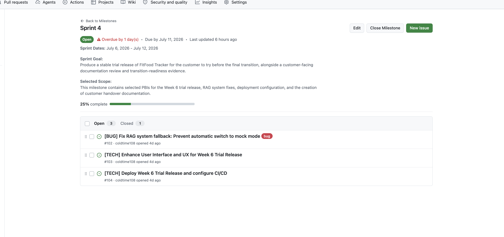
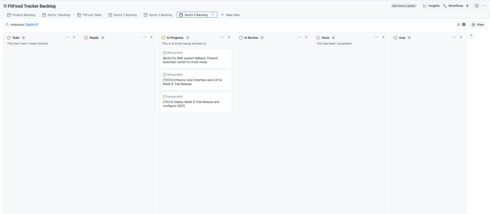

# FitFood Tracker — Week 6 Report (Assignment 6, Sprint 4)

**FitFood** is an AI-powered web application for smart pantry management, personalised macronutrient tracking, and LLM-based meal planning. Users manage their fridge inventory, scan grocery receipts, log meals, and receive recipe recommendations based on what is actually available at home.

**Team 27** · [MIT License](../../LICENSE)

---

## Table of Contents

- [1. Sprint 4 Overview](#1-sprint-4-overview)
- [2. Week 6 Trial-Release Changes](#2-week-6-trial-release-changes)
- [3. Customer Feedback Response](#3-customer-feedback-response)
- [4. Customer-Facing Documentation Review](#4-customer-facing-documentation-review)
- [5. Transition-Readiness Summary](#5-transition-readiness-summary)
- [6. Quality Requirements and CI](#6-quality-requirements-and-ci)
- [7. User Acceptance Testing](#7-user-acceptance-testing)
- [8. Sprint Review](#8-sprint-review)
- [9. Release and Changelog](#9-release-and-changelog)
- [10. Deployed Product and Access](#10-deployed-product-and-access)
- [11. Hosted Documentation](#11-hosted-documentation)
- [12. Documentation Links](#12-documentation-links)
- [13. Product Status](#13-product-status)
- [14. Expected Week 7 Follow-Up Work](#14-expected-week-7-follow-up-work)
- [15. Contribution Traceability](#15-contribution-traceability)
- [16. Screenshots](#16-screenshots)
- [17. Reports](#17-reports)

---

## 1. Sprint 4 Overview

- **Sprint dates:** 06 July 2026 – 12 July 2026
- **Sprint milestone:** [Sprint 4](https://github.com/xqzme-otec/fitFood/milestone/4)
- **Product Backlog board/view:** [GitHub Projects — FitFood Tracker Backlog](https://github.com/users/coldtime108/projects/1/views/1)
- **Sprint Backlog board/view:** [GitHub Projects — Sprint 4 Backlog](https://github.com/users/coldtime108/projects/1/views/1) (filtered with `milestone:"Sprint 4"`)
- **Total Sprint size:** around 30

**Sprint Goal:** Produce a stable trial release of FitFood Tracker for the customer to try before the final transition, alongside a customer-facing documentation review and transition-readiness evidence.

**Selected Sprint scope:**

| Issue | Item | Status |
| --- | --- | --- |
| [#102](https://github.com/xqzme-otec/fitFood/issues/102) | Fix RAG system fallback: Prevent automatic switch to mock mode | Done |
| [#103](https://github.com/xqzme-otec/fitFood/issues/103) | Enhance User Interface and UX for Week 6 Trial Release | Done |
| [#104](https://github.com/xqzme-otec/fitFood/issues/104) | Deploy Week 6 Trial Release and configure CI/CD | In Progress |

---

## 2. Week 6 Trial-Release Changes

| Feature | Status at Sprint Review |
| --- | --- |
| LLM-based meal plan generation (RAG approach) | **Done** — full day generated from fridge contents |
| Fridge → meal ingredient sourcing | **Done** — all generated dishes use only fridge products |
| Fridge quantity deduction on "I ate this" | **Done** — automatic per-ingredient deduction confirmed live |
| Meal rejection → alternative suggestion | **Done** — "No" triggers re-generation |
| KBZHU tracking in generated meals | **Done** — passed to LLM with fridge ingredients |
| UI/UX enhancements (contrast, layout) | **Done** |
| External deployment | **Not done** — local only; deployment issues unresolved |
| Webcam-based receipt scanning (HTTPS) | **Not done** — requires production HTTPS server |
| Generation speed optimisation | **Deferred** — 120B parameter model is slow but acceptable for MVP |

---

## 3. Customer Feedback Response

| Feedback point | Resulting PBI or issue | Status | Response |
| --- | --- | --- | --- |
| **Fridge ↔ meal consumption deduction** (top priority from Sprint 3) | [#102](https://github.com/xqzme-otec/fitFood/issues/102) / internal | **Done** | Implemented automatic per-ingredient deduction from fridge on "I ate this" confirmation |
| **LLM generation quality and diversity** (from Sprint 3) | [#102](https://github.com/xqzme-otec/fitFood/issues/102) | **Done** | RAG approach: fridge contents passed to LLM; dishes generated only from available ingredients |
| **UI contrast and accessibility** (from Sprint 3) | [#103](https://github.com/xqzme-otec/fitFood/issues/103) | **Done** | Colour palette and layout improvements applied |
| **External deployment / customer access** (from Sprint 3) | [#104](https://github.com/xqzme-otec/fitFood/issues/104) | **Not done** | Deployment issues unresolved; product runs locally only |
| **Webcam receipt scanning (HTTPS)** (from Sprint 3) | Blocked by deployment | **Not done** | Camera permission requires HTTPS; unblocks after deployment is resolved |
| **Chestny Znak expiry date integration** (customer key requirement) | not done yet | **Carried to Sprint 5** | API access is restricted; investigation ongoing |

**Feedback not yet addressed:** External deployment and webcam scanning remain open due to server-side issues. Chestny Znak integration is carried to Sprint 5. Customer confirmed these gaps are known and agreed to send written feedback for Sprint 5 prioritisation.

---

## 4. Customer-Facing Documentation Review

The following documentation was reviewed with the customer during the Week 6 trial-readiness meeting:

| Document | Customer finding |
| --- | --- |
| [`README.md`](../../README.md) | Accepted — setup and run instructions are clear for a developer audience |
| [`docs/customer-handover.md`](../../docs/customer-handover.md) | Accepted — current handover state is transparently described |
| Access / run instructions (`README.md` Docker section) | Clear — customer confirmed they can run locally via Docker Compose |
| Deployment instructions | Noted gap — external server not yet accessible; documented as known limitation |
| Known limitations | Accepted — LLM mock mode, HTTPS-blocked webcam, and Chestny Znak restriction are documented |

**What the customer found clear:** setup steps, product overview, fridge deduction flow, the overall product direction.

**What the customer found unclear or missing:** no externally accessible URL yet; no Chestny Znak integration documented as a firm limitation.

**Customer stated:** documentation is sufficient for the current trial level; final handover documentation should note the deployment limitation explicitly.

---

## 5. Transition-Readiness Summary

| Area | Status at Week 6 |
| --- | --- |
| Core product features | Ready — LLM generation, fridge deduction, receipt scanning (file upload), KBZU tracking |
| External deployment | **Not ready** — product accessible via local Docker Compose only |
| Repository access | In progress — customer to be added as repository owner in Sprint 5 |
| Customer-handover documentation | Complete for current state; to be updated in Sprint 5 |
| Webcam receipt scanning | Blocked by HTTPS requirement — unblocks with deployment |
| Customer independent testing | Deferred — customer agreed to test locally and provide written feedback |

**Handover level reached (Week 6):** `Ready for independent use` (pending deployment fix)

**Customer confirmation status:** `Accepted with follow-up items`

**What must still happen in Week 7:**
1. Resolve external deployment — customer must be able to access the product without cloning locally
2. Transfer repository ownership to customer
3. Act on customer's written feedback (expected within 1–2 days of the Week 6 meeting)
4. Finalise and tag MVP v3 release
5. Update `docs/customer-handover.md` with final handover state

---

## 6. Quality Requirements and CI

- **Quality requirements:** [`docs/quality-requirements.md`](../../docs/quality-requirements.md)
- **Quality Requirement Tests:** [`docs/quality-requirement-tests.md`](../../docs/quality-requirement-tests.md)
- **Testing strategy:** [`docs/testing.md`](../../docs/testing.md)
- **Definition of Done:** [`docs/definition-of-done.md`](../../docs/definition-of-done.md)
- **CI pipeline:** <https://github.com/xqzme-otec/fitFood/actions>
- **Latest protected-default-branch CI run:** https://github.com/xqzme-otec/fitFood/actions/runs/29198043764

All CI gates from Assignment 4 and Assignment 5 remain active: `tests` workflow (pytest, coverage, critical-module gate), `qa` workflow (Bandit + pip-audit), and `lychee` (Markdown link checking).

| Critical module | Coverage |
| --- | --- |
| `app/services/nutrition.py` | 97% |
| `app/services/targets.py` | 86% |
| `app/services/recommendation.py` | 95% |
| `app/services/classifier.py` | 90% |
| `app/services/receipt.py` | 90% |
| `app/services/fridge.py` | 97% |

---

## 7. User Acceptance Testing

Full UAT scenarios with execution history: [`docs/user-acceptance-tests.md`](../../docs/user-acceptance-tests.md)

| Scenario | Week 6 result | Notes |
| --- | --- | --- |
| Generate a full day meal plan from fridge contents | **Demonstrated — passed** | LLM generated contextually relevant dishes using only fridge ingredients |
| Fridge quantity deduction after eating | **Demonstrated — passed** | 60 g deducted from chicken strips after marking meal as eaten; visible in fridge view |
| View ingredient list for generated meal | **Demonstrated — passed** | Per-ingredient breakdown shown in meal card |
| Meal rejection and alternative suggestion | **Demonstrated — passed** | "No" action triggers alternative generation |
| Scan a receipt (file upload) | Not re-tested | Stable from Sprint 3 |
| Customer independent app testing | **Deferred** | Customer will test locally and send written feedback |
| Webcam receipt scanning | **Not tested** | Requires HTTPS; blocked by deployment |

**Most important feedback points:**
- Customer confirmed end-to-end generation and fridge deduction flow as working: *"That's great — everything is working properly."*
- Customer satisfied with outcome overall: *"I'm satisfied with the outcome. I like how it looks, I like that products are added and removed."*
- External deployment remains the primary blocker for independent customer testing.

**Resulting PBIs for Sprint 5:** resolve deployment, transfer repository ownership, act on written feedback, finalise MVP v3.

---

## 8. Sprint Review

- **Sprint Review transcript (public):** [sprint-review-transcript.md](sprint-review-transcript.md) — published with team permission; names replaced with roles; off-topic fragments removed.
- **Sprint Review summary:** [sprint-review-summary.md](sprint-review-summary.md)
- **Recording:** submitted privately via Moodle (not committed to the public repository).

**Sprint 4 increment status: Accepted with follow-up items.** Core generation and fridge deduction features accepted. Customer will review code independently and may raise additional items. Deployment and webcam scanning remain open. Final acceptance deferred until written feedback is received and Sprint 5 work is complete.

---

## 9. Release and Changelog

- **Week 6 SemVer trial release:** [v3.0.0-trial](https://github.com/xqzme-otec/fitFood/releases/tag/v3.0.0-trial) — Week 6 Trial Release (Sprint 4) for Assignment 6
- **CHANGELOG:** [`CHANGELOG.md`](../../CHANGELOG.md)

_TODO: embed screenshot of the Week 6 release page from `reports/week6/images/` once created._

---

## 10. Deployed Product and Access

- **Deployed product (local only):** <http://10.93.26.202:8000/> — university VM, campus network only; external access not yet resolved
- **Run / access instructions:** [root README](../../README.md)
- **Docker Compose (recommended):** `docker compose up --build -d` then open <http://127.0.0.1:8000/>

> **Known limitation:** the university VM is not reachable from outside the campus network. During the Sprint 4 Review the product was demonstrated via local Docker Compose. Resolving external access is the top Sprint 5 priority.

---

## 11. Hosted Documentation

Hosted documentation site: <https://xqzme-otec.github.io/fitFood/>

Published from [`docs/`](../../docs/) via [`.github/workflows/docs.yml`](../../.github/workflows/docs.yml).

---

## 12. Documentation Links

| Document | Link |
| --- | --- |
| Root README | [`README.md`](../../README.md) |
| Contributing guide | [`CONTRIBUTING.md`](../../CONTRIBUTING.md) |
| Agent guide | [`AGENTS.md`](../../AGENTS.md) |
| Customer handover | [`docs/customer-handover.md`](../../docs/customer-handover.md) |
| Roadmap | [`docs/roadmap.md`](../../docs/roadmap.md) |
| Definition of Done | [`docs/definition-of-done.md`](../../docs/definition-of-done.md) |
| Testing strategy | [`docs/testing.md`](../../docs/testing.md) |
| Quality requirements | [`docs/quality-requirements.md`](../../docs/quality-requirements.md) |
| Quality requirement tests | [`docs/quality-requirement-tests.md`](../../docs/quality-requirement-tests.md) |
| User acceptance tests | [`docs/user-acceptance-tests.md`](../../docs/user-acceptance-tests.md) |
| Development process | [`docs/development-process.md`](../../docs/development-process.md) |
| Architecture | [`docs/architecture/README.md`](../../docs/architecture/README.md) |

---

## 13. Product Status

FitFood at the end of Sprint 4 (Week 6):

- **LLM-based meal plan generation (RAG)** — generates a full daily meal plan from fridge contents; dishes are composed by the LLM from available ingredients with KBZHU budget tracking.
- **Fridge quantity deduction on eating** — when a user confirms "I ate this", each ingredient is individually deducted from the fridge inventory.
- **Meal rejection and alternative generation** — declining a dish triggers re-generation of an alternative.
- **Receipt scanner (file upload)** — stable from Sprint 3.
- **KBZU tracking, diary, profile, fridge inventory** — stable from Sprints 1–3.
- **Architecture documentation and CI** — maintained from Assignment 5.

Not yet done: external deployment, webcam scanning, Chestny Znak integration, generation diversity/rejection memory.

---

## 14. Expected Week 7 Follow-Up Work

| Priority | Action |
| --- | --- |
| 1 | Resolve external deployment — customer must access product independently |
| 2 | Transfer repository ownership to customer |
| 3 | Receive and act on customer's written feedback; convert to Sprint 5 PBIs |
| 4 | Complete webcam receipt scanning (unblocks after deployment) |
| 5 | Finalise Chestny Znak integration or document as firm limitation |
| 6 | Finalise and tag MVP v3 release |
| 7 | Update `docs/customer-handover.md` with final handover state |
| 8 | Record and publish public sanitised demo video |

---

## 15. Contribution Traceability

| Member | GitHub | Role | Sprint 4 issues | PRs created | PRs reviewed | Other |
| --- | --- | --- | --- | --- | --- | --- |
| Daniil Vishnevskii | [@xqzme-otec](https://github.com/xqzme-otec) | Product Owner · Tech Lead · Data Engineer | can be seen on github | [PRs](https://github.com/xqzme-otec/fitFood/pulls?q=is%3Apr+author%3Axqzme-otec) | can be seen on github | LLM generation implementation, RAG logic |
| Timur Ishmuratov | [@coldtime108](https://github.com/coldtime108) | Scrum Master · Backend Developer | can be seen on github | [PRs](https://github.com/xqzme-otec/fitFood/pulls?q=is%3Apr+author%3Acoldtime108) | can be seen on github | Customer meeting facilitation, handover docs |
| Artemiy Tiglev | [@wolonee](https://github.com/wolonee) | Developer · Software Architect · Backend | can be seen on github | [PRs](https://github.com/xqzme-otec/fitFood/pulls?q=is%3Apr+author%3Awolonee) | can be seen on github | Fridge deduction, backend integration |
| Pavel Romanov | [@Pasha12122000](https://github.com/Pasha12122000) | Developer · Frontend · Integration | can be seen on github | [PRs](https://github.com/xqzme-otec/fitFood/pulls?q=is%3Apr+author%3APasha12122000) | can be seen on github | Deployment work, CI/CD configuration |
| Egor Gilmanov | [@Riderufa1984](https://github.com/Riderufa1984) | Developer · Frontend · UI/UX | can be seen on github | [PRs](https://github.com/xqzme-otec/fitFood/pulls?q=is%3Apr+author%3ARiderufa1984) | can be seen on github | UI/UX enhancements, documentation |

---

## 16. Screenshots

Add screenshots to [`reports/week6/images/`](images/) and embed them here.

**Sprint 4 milestone**

**Sprint 4 Backlog board view**

**Week 6 SemVer trial release**
_TODO: add screenshot_

**Example reviewed, issue-linked PR**

---

## 17. Reports

- [Sprint Review Summary](sprint-review-summary.md)
- [Sprint Review Transcript](sprint-review-transcript.md)
- [Reflection](reflection.md)
- [Retrospective](retrospective.md)
- [LLM Report](llm-report.md)
