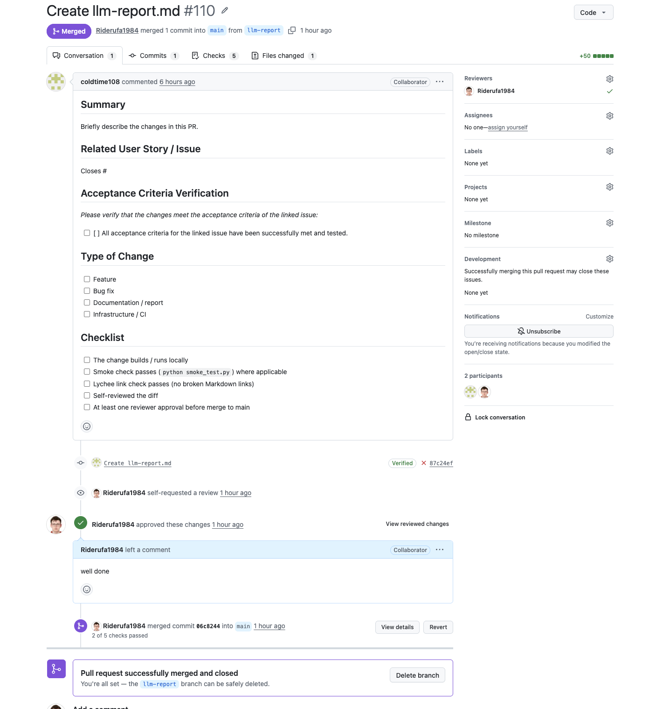

# FitFood Tracker — Week 7 Report (Assignment 6, Sprint 5 / MVP v3)

**Week 6 evidence:** [reports/week6/README.md](../week6/README.md)

**Team 27** · [MIT License](../../LICENSE)

---

## Table of Contents

- [1. Sprint 5 Overview](#1-sprint-5-overview)
- [2. Week 7 Follow-Up and MVP v3 Changes](#2-week-7-follow-up-and-mvp-v3-changes)
- [3. Final Transition Outcome](#3-final-transition-outcome)
- [4. Customer Feedback Response (Sprint 5)](#4-customer-feedback-response-sprint-5)
- [5. User Acceptance Testing (Week 7)](#5-user-acceptance-testing-week-7)
- [6. Release and Changelog](#6-release-and-changelog)
- [7. Deployed Product and Access](#7-deployed-product-and-access)
- [8. Demo Video](#8-demo-video)
- [9. Demo Day Preparation](#9-demo-day-preparation)
- [10. Hosted Documentation](#10-hosted-documentation)
- [11. Documentation Links](#11-documentation-links)
- [12. Final Product Status](#12-final-product-status)
- [13. Sprint Review](#13-sprint-review)
- [14. Contribution Traceability](#14-contribution-traceability)
- [15. Screenshots](#15-screenshots)
- [16. Reports](#16-reports)

---

## 1. Sprint 5 Overview

- **Sprint dates:** 13 July 2026 – 19 July 2026
- **Sprint milestone:** [Sprint 5](https://github.com/xqzme-otec/fitFood/milestone/5)
- **Product Backlog board/view:** [GitHub Projects — FitFood Tracker Backlog](https://github.com/users/coldtime108/projects/1/views/1)
- **Sprint Backlog board/view:** [GitHub Projects — Sprint 5 Backlog](https://github.com/users/coldtime108/projects/1/views/1) (filtered with `milestone:"Sprint 5"`)
- **Total Sprint size:** 20~

**Sprint Goal:** Perform follow-up maintenance based on the customer's Week 6 trial feedback, finalise transition work, and deliver the final course version (MVP v3) of FitFood Tracker.

**Selected Sprint scope:**

| Issue | Item | Status |
| --- | --- | --- |
| [TRANSITION] | Conduct Final Transition Meeting and Obtain Customer Acceptance | Done |
| Internal | Fix onboarding / registration flow bug | Done |
| Internal | Regression testing of existing functionality | Done |
| Internal | Resolve external deployment (globally accessible server) | Done |
| Internal | Finalise `docs/customer-handover.md` | Done |
| Internal | Tag and release MVP v3 | Done |

---

## 2. Week 7 Follow-Up and MVP v3 Changes

Sprint 5 was intentionally focused on stability, transition, and handover rather than new features.

| Change | Status | Notes |
| --- | --- | --- |
| External deployment resolved | **Done** | Application is now publicly accessible; customer confirmed no technical issues |
| Onboarding / registration bug fix | **Done** | Developer A resolved registration flow issues identified during Week 6 |
| Regression testing | **Done** | Existing functionality verified after bug fix |
| `docs/customer-handover.md` finalised | **Done** | Reflects actual handover state and known limitations |
| Repository ownership transfer to customer | **Agreed** | Timing to be coordinated post-course |
| MVP v3 SemVer release tagged | **Done** | Final course version on protected `main` branch |
| No new features added | Intentional | Sprint 5 focus: stability, documentation, handover |

---

## 3. Final Transition Outcome

**Handover level reached:** `Independently used by customer`

**Customer confirmation status:** `Accepted with follow-up items`

The customer independently ran the application, explored the interface, and reviewed the source code prior to the final Sprint Review call. The application was confirmed working on the customer's side with no technical issues. The customer explicitly stated the project is ready for final handover and confirmed: *"Accepted — with some future ideas."*

### What was transferred or made available

| Item | Status |
| --- | --- |
| Source code (public GitHub repository) | Available — customer has full access |
| Repository ownership | Agreed — transfer to be completed post-course |
| Deployed instance (external URL) | Available — accessible globally |
| `docs/customer-handover.md` | Complete — documents setup, limitations, and handover scope |
| `README.md` with run instructions | Available |
| Docker Compose setup (one-command run) | Available — customer confirmed successful local deployment |

### Remaining limitations and follow-up items

- Webcam-based receipt scanning requires HTTPS production deployment
- Chestny Znak expiry date integration not completed — LLM estimation used as fallback
- Generation speed depends on hosted model response time (120B parameter model)
- Single-user MVP; family/multi-user support deferred to future development
- Custom model fine-tuning not implemented; prompt-based LLM approach used instead

**Customer statement on remaining items:** *"Future ideas"* — explicitly non-blocking for acceptance.

### Customer independent use evidence

- Customer confirmed: *"I ran it and explored it — I clicked through and looked at the internals."*
- Customer confirmed no technical issues on their side.
- Customer reviewed source code independently prior to the final call.
- Written Telegram confirmation requested; customer agreed to send by Sunday 19 July 2026.

### Customer acceptance statement (on record)

> **Q:** "In your opinion, is the project ready for final handover?"
> **A:** *"Yes, definitely."*

> **Q:** "Accepted / Accepted with future ideas / Not accepted — which applies?"
> **A:** *"Accepted — with some future ideas."*

### `docs/customer-handover.md` acceptance

Customer opened `docs/customer-handover.md` during the call. Full read deferred to asynchronous review by Sunday. Customer agreed to send written Telegram confirmation once reviewed.

---

## 4. Customer Feedback Response (Sprint 5)

| Feedback point | Action taken | Status |
| --- | --- | --- |
| Deployment not working (from Week 6) | Daniil resolved deployment; application now globally accessible | **Done** |
| Onboarding / registration issues (identified in Week 6 trial) | Developer A fixed registration flow | **Done** |
| Customer requested repository ownership transfer | Agreed on record; transfer to be coordinated post-course | **Agreed** |
| Future ideas (custom model training, grocery delivery, multi-user) | Documented as post-course non-blocking enhancements in `docs/customer-handover.md` | **Documented** |
| Chestny Znak integration | Documented as known limitation with LLM fallback | **Documented** |

---

## 5. User Acceptance Testing (Week 7)

Full UAT scenarios: [`docs/user-acceptance-tests.md`](../../docs/user-acceptance-tests.md)

| Scenario | Week 7 result | Notes |
| --- | --- | --- |
| Customer independently ran the application | **Passed** | Confirmed on record: *"I ran it and explored it"* |
| Application deployed on customer side | **Passed** | No technical issues reported |
| Customer reviewed source code | **Passed** | Customer read implementation independently before the call |
| Register and complete profile setup | **Passed** | Onboarding bug fixed by Developer A this sprint |
| Generate meal plan from fridge contents | **Stable** | Not re-tested; stable from Sprint 4 |
| Fridge deduction after eating | **Stable** | Not re-tested; stable from Sprint 4 |
| Customer reviewed `docs/customer-handover.md` | **In progress** | Opened during call; full confirmation by Sunday |

---

## 6. Release and Changelog

- **Final SemVer release mapped to MVP v3:** _TODO: [vX.X.X](https://github.com/xqzme-otec/fitFood/releases/tag/vX.X.X)_
- **CHANGELOG:** [`CHANGELOG.md`](../../CHANGELOG.md)

_TODO: embed screenshot of the MVP v3 release page._

---

## 7. Deployed Product and Access

- **Deployed product:** http://10.93.26.202:8000/
- **Run / access instructions:** [root README](../../README.md)
- **Docker Compose:** `docker compose up --build -d` → open <http://127.0.0.1:8000/>

Deployment was resolved in Sprint 5. The application is now publicly accessible externally. Customer confirmed successful access on their side.

---

## 8. Demo Video

_TODO: link to public sanitised demo video (< 2 minutes) showing MVP v3._

Public sanitised demo video: _TODO_

---

## 9. Demo Day Preparation

The team completed the required Week 7 lab rehearsal presentation. The slide deck covers:

- Project context and target users
- Final product and most important delivered requirements
- Pre-recorded demo (under 2 minutes)
- Customer usefulness and handover status
- Key engineering, process, and quality evidence
- Remaining limitations
- Team contribution and reflection

Slide deck submitted as PDF with the Week 6 and Week 7 Moodle PDFs. Rehearsed presentation video submitted privately via the Week 6 Moodle PDF. Week 7 lab rehearsal attended by all team members.

---

## 10. Hosted Documentation

Hosted documentation site: <https://xqzme-otec.github.io/fitFood/>

Published from [`docs/`](../../docs/) via [`.github/workflows/docs.yml`](../../.github/workflows/docs.yml).

---

## 11. Documentation Links

| Document | Link |
| --- | --- |
| Week 6 report | [reports/week6/README.md](../week6/README.md) |
| Root README | [`README.md`](../../README.md) |
| Contributing guide | [`CONTRIBUTING.md`](../../CONTRIBUTING.md) |
| Agent guide | [`AGENTS.md`](../../AGENTS.md) |
| Customer handover | [`docs/customer-handover.md`](../../docs/customer-handover.md) |
| Roadmap | [`docs/roadmap.md`](../../docs/roadmap.md) |
| Definition of Done | [`docs/definition-of-done.md`](../../docs/definition-of-done.md) |
| Testing strategy | [`docs/testing.md`](../../docs/testing.md) |
| Quality requirements | [`docs/quality-requirements.md`](../../docs/quality-requirements.md) |
| Quality requirement tests | [`docs/quality-requirement-tests.md`](../../docs/quality-requirement-tests.md) |
| User acceptance tests | [`docs/user-acceptance-tests.md`](../../docs/user-acceptance-tests.md) |
| Development process | [`docs/development-process.md`](../../docs/development-process.md) |
| Architecture | [`docs/architecture/README.md`](../../docs/architecture/README.md) |

---

## 12. Final Product Status

FitFood delivered as MVP v3 includes:

- User registration and goal-based profile setup (fixed onboarding in Sprint 5)
- Daily calorie target calculation (KBZHU) with Mifflin-St Jeor BMR formula
- Product inventory (fridge) management with quantity tracking and expiry date alerts
- Product search backed by a grocery retailer dataset with LLM KBZHU fallback
- Recipe database (built-in + user-added recipes)
- LLM-based meal plan generation using fridge contents and candidate recipes (RAG approach)
- Fridge quantity deduction on meal consumption ("I ate this")
- Meal rejection and alternative suggestion flow
- Receipt scanner (file upload; API-based, OCR mock)
- Architecture documentation (3 views, 4 ADRs), CI pipeline (pytest, Bandit, pip-audit, lychee)

**Not implemented (documented limitations):** webcam receipt scanning (requires HTTPS), Chestny Znak integration, custom model fine-tuning, multi-user support.

---

## 13. Sprint Review

- **Sprint Review transcript (public):** [sprint-review-transcript.md](sprint-review-transcript.md) — published with team permission; names replaced with roles
- **Sprint Review summary:** [sprint-review-summary.md](sprint-review-summary.md)
- **Recording:** submitted privately via Moodle

**Sprint 5 Goal: Met.** Deployment resolved, onboarding bug fixed, customer confirmed independent use, acceptance obtained on record. MVP v3 released.

---

## 14. Contribution Traceability

| Member | GitHub | Role | Sprint 5 issues | PRs created | PRs reviewed | Other |
| --- | --- | --- | --- | --- | --- | --- |
| Daniil Vishnevskii | [@xqzme-otec](https://github.com/xqzme-otec) | Product Owner · Tech Lead · Data Engineer | can be seen on github | [PRs](https://github.com/xqzme-otec/fitFood/pulls?q=is%3Apr+author%3Axqzme-otec) | can be seen on github | Resolved external deployment; fixed registration bug |
| Timur Ishmuratov | [@coldtime108](https://github.com/coldtime108) | Scrum Master · Backend Developer | can be seen on github| [PRs](https://github.com/xqzme-otec/fitFood/pulls?q=is%3Apr+author%3Acoldtime108) | can be seen on github | Final transition meeting facilitation; handover docs; customer acceptance |
| Artemiy Tiglev | [@wolonee](https://github.com/wolonee) | Developer · Software Architect · Backend | can be seen on github | [PRs](https://github.com/xqzme-otec/fitFood/pulls?q=is%3Apr+author%3Awolonee) | can be seen on github | Regression testing; backend stability |
| Pavel Romanov | [@Pasha12122000](https://github.com/Pasha12122000) | Developer · Frontend · Integration | can be seen on github | [PRs](https://github.com/xqzme-otec/fitFood/pulls?q=is%3Apr+author%3APasha12122000) | can be seen on github | Deployment configuration; CI/CD |
| Egor Gilmanov | [@Riderufa1984](https://github.com/Riderufa1984) | Developer · Frontend · UI/UX | can be seen on github | [PRs](https://github.com/xqzme-otec/fitFood/pulls?q=is%3Apr+author%3ARiderufa1984) | can be seen on github | Documentation; reporting; customer communication |

---

## 15. Screenshots

Add screenshots to [`reports/week7/images/`](images/) and embed them here.

**Sprint 5 milestone**

**Sprint 5 Backlog board view**

**MVP v3 SemVer release**
_TODO: add screenshot_

**Example reviewed, issue-linked PR**

---

## 16. Reports

- [Sprint Review Summary](sprint-review-summary.md)
- [Sprint Review Transcript](sprint-review-transcript.md)
- [Reflection](reflection.md)
- [Retrospective](retrospective.md)
- [LLM Report](llm-report.md)
